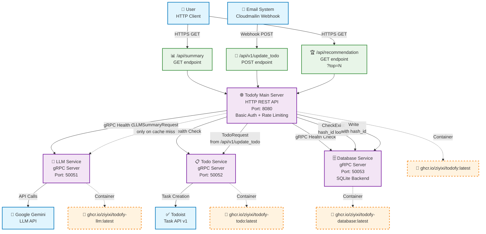
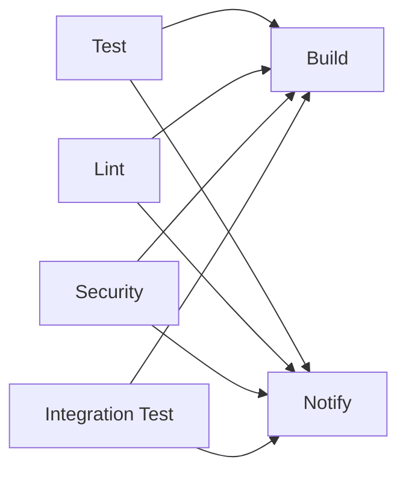

# Todofy - Self-Hosted Task Management Tool

[](https://github.com/ziyixi/todofy/actions/workflows/ci.yml)
[](https://codecov.io/gh/ziyixi/todofy)

Todofy is a self-hosted task management tool designed to help you organize and prioritize your tasks efficiently. It's built as a collection of microservices communicating over gRPC, with email-driven task creation routed to Todoist and Google Gemini-based summarization.

## 🏗️ Architecture


```mermaid
graph TB
    %% External systems and users
    User[👤 User<br/>HTTP Client]
    Email[📧 Email System<br/>Cloudmailin Webhook]
    
    %% External services
    Gemini[🤖 Google Gemini<br/>LLM API]
    Todoist[✅ Todoist<br/>Task API v1]
    
    %% Main HTTP Server
    Main[🌐 Todofy Main Server<br/>HTTP REST API<br/>Port: 8080<br/>Basic Auth + Rate Limiting]
    
    %% Microservices
    LLM[🧠 LLM Service<br/>gRPC Server<br/>Port: 50051]
    Todo[📋 Todo Service<br/>gRPC Server<br/>Port: 50052]
    DB[🗄️ Database Service<br/>gRPC Server<br/>Port: 50053<br/>SQLite Backend]
    
    %% API endpoints
    Summary[📊 /api/summary<br/>GET endpoint]
    UpdateTodo[📝 /api/v1/update_todo<br/>POST endpoint]
    Recommend[🏆 /api/recommendation<br/>GET endpoint<br/>?top=N]
    
    %% Data flow connections
    User -->|HTTPS GET| Summary
    User -->|HTTPS GET| Recommend
    Email -->|Webhook POST| UpdateTodo
    
    Summary --> Main
    UpdateTodo --> Main
    Recommend --> Main
    
    Main -->|gRPC Health Check| LLM
    Main -->|gRPC Health Check| Todo  
    Main -->|gRPC Health Check| DB
    
    %% Dedup cache flow: check DB first, then conditionally call LLM
    Main -->|CheckExist<br/>hash_id lookup| DB
    Main -.->|LLMSummaryRequest<br/>only on cache miss| LLM
    Main -->|TodoRequest<br/>from /api/v1/update_todo| Todo
    Main -->|Write<br/>with hash_id| DB
    
    LLM -->|API Calls| Gemini
    Todo -->|Task Creation| Todoist
    
    %% Service descriptions
    Main -.->|Container| MainContainer[🐳 ghcr.io/ziyixi/todofy:latest]
    LLM -.->|Container| LLMContainer[🐳 ghcr.io/ziyixi/todofy-llm:latest]
    Todo -.->|Container| TodoContainer[🐳 ghcr.io/ziyixi/todofy-todo:latest] 
    DB -.->|Container| DBContainer[🐳 ghcr.io/ziyixi/todofy-database:latest]
    
    %% Styling
    classDef external fill:#e1f5fe,stroke:#0277bd,stroke-width:2px
    classDef service fill:#f3e5f5,stroke:#7b1fa2,stroke-width:2px
    classDef endpoint fill:#e8f5e8,stroke:#388e3c,stroke-width:2px
    classDef container fill:#fff3e0,stroke:#f57c00,stroke-width:2px,stroke-dasharray: 5 5
    
    class User,Email,Gemini,Todoist external
    class Main,LLM,Todo,DB service
    class Summary,UpdateTodo,Recommend endpoint
    class MainContainer,LLMContainer,TodoContainer,DBContainer container
```

## ✨ Features

<details>
<summary><strong>Expand feature list</strong></summary>

* **Task Management:** Core functionality for creating, updating, and managing tasks.
* **LLM Integration:** Leverages Google Gemini models for email summarization with automatic model fallback (via `todofy-llm` service).
* **Cost Controls:** Daily token limit with 24-hour sliding window (default: 3M tokens) to prevent runaway API costs, plus email content truncation (50K character hard limit).
* **Dedup Cache:** SHA-256 hash-based deduplication — identical emails skip the expensive LLM call and reuse the cached summary from the database.
* **Summary API:** `GET /api/summary` returns structured JSON: `summary`, `task_count`, and `time_window_hours`.
* **Task Recommendations:** `GET /api/recommendation?top=N` queries recent 24h tasks, asks the LLM to pick the top-N most important ones (default 3, max 10), and returns structured JSON with rank, title, and reason for each.
* **Todoist-Only Task Population:** Incoming tasks are created in Todoist through `todofy-todo`.
* **Todoist DAG Dependencies:** Supports task-title metadata (`<k:task-key dep:other-key,...>`) and reconcile-driven dependency analysis.
* **Reserved DAG Labels:** Automatically manages `dag_blocked`, `dag_cycle`, `dag_broken_dep`, and `dag_invalid_meta` with minimal label diffs.
* **Manual DAG Operations:** Exposes reconcile, bootstrap-key, status, and issue endpoints under `/api/v1/dependency/*`.
* **Webhook-as-Hint Flow:** Supports Todoist webhook verification and dirty-mark signaling; scheduled/manual reconcile remains the source of truth.
* **Persistent Storage:** Uses SQLite for storing task data with hash-indexed lookups (via `todofy-database` service).
* **Containerized Services:** All components are containerized using Docker for easy deployment and scaling.
* **Comprehensive Testing:** Unit tests, e2e tests with mock Gemini client injection, and Docker-based integration tests.

</details>

## 📡 API Behavior

<details>
<summary><strong>Expand API behavior and endpoints</strong></summary>

### `GET /api/summary`

Returns a 24-hour summary payload with no task delivery side effect:

```json
{
  "summary": "string",
  "task_count": 3,
  "time_window_hours": 24
}
```

### Dependency Control Endpoints (Basic Auth Required)

* `POST /api/v1/dependency/reconcile` (`?dry_run=true` for analyze-only)
* `POST /api/v1/dependency/bootstrap_keys` (`?dry_run=true` by default)
* `GET /api/v1/dependency/status?task_key=...` (or `todoist_task_id=...`)
* `GET /api/v1/dependency/issues?type=...&task_key=...`

### Todoist Webhook Endpoint (No Basic Auth)

* `POST /api/v1/todoist/webhook`
* Signature verification is delegated to the Todoist gRPC integration layer.
* Endpoint returns HTTP `200` for delivery compatibility; webhook only marks graph state dirty.

</details>

## 🧠 LLM Service Details

<details>
<summary><strong>Expand LLM model and cost-control details</strong></summary>

The LLM service uses Google Gemini for email summarization with several cost-control and reliability features:

### Supported Models

Models are tried in priority order for automatic fallback:

1. `gemini-2.5-flash-lite` (fastest, cheapest)
2. `gemini-2.5-flash` (balanced)
3. `gemini-3-flash-preview` (latest)

Additionally, `gemini-2.5-pro` is available when explicitly requested.

### Cost Controls

| Feature | Default | Description |
|---------|---------|-------------|
| Daily token limit | 3,000,000 | 24-hour sliding window; configurable via `--daily-token-limit` flag (0 = unlimited) |
| Email content limit | 50,000 chars | Hard truncation of email body before LLM processing |
| Token counting | Per-request | Content is iteratively truncated (to 90%) until under the per-model token limit (1M tokens) |
| Dedup cache | Always on | SHA-256 hash of `prompt + email content`; duplicate emails return cached summary without LLM call |

### Configuration Flags

| Flag | Default | Description |
|------|---------|-------------|
| `--port` | `50051` | gRPC server port |
| `--gemini-api-key` | (required) | Google Gemini API key |
| `--daily-token-limit` | `3000000` | Max tokens per 24h sliding window (0 = unlimited) |

</details>

## 🛠️ Services

<details>
<summary><strong>Expand per-service reference</strong></summary>

The application is composed of the following services:

1.  **Todofy (Main App)**
    * Description: The primary user-facing application and HTTP API gateway.
    * Dockerfile: `./Dockerfile`
    * Default Port: `8080` (configurable via `PORT` env var)
    * Image: `ghcr.io/ziyixi/todofy:latest`

2.  **LLM Service (`todofy-llm`)**
    * Description: Email summarization via Google Gemini with model fallback and daily token tracking.
    * Dockerfile: `llm/Dockerfile`
    * Default Port: `50051` (configurable via `--port` flag)
    * Image: `ghcr.io/ziyixi/todofy-llm:latest`

3.  **Todo Service (`todofy-todo`)**
    * Description: Manages Todoist integration (create/read/list/update labels/webhook verify) and dependency DAG reconcile services.
    * Dockerfile: `todo/Dockerfile`
    * Default Port: `50052` (configurable via `--port` flag)
    * Image: `ghcr.io/ziyixi/todofy-todo:latest`

4.  **Database Service (`todofy-database`)**
    * Description: Provides database access and management using SQLite. Supports `Write`, `QueryRecent`, and `CheckExist` (hash-based dedup lookup) RPCs.
    * Dockerfile: `database/Dockerfile`
    * Default Port: `50053` (configurable via `PORT` env var)
    * Image: `ghcr.io/ziyixi/todofy-database:latest`

</details>

## 🐳 Deployment Setup

Use the collapsible sections below for operational setup details.

<details>
<summary><strong>Required environment variables</strong></summary>

### `todofy` (main HTTP service)

| Variable | Required | Example |
|----------|----------|---------|
| `PORT` | Yes | `8080` |
| `ALLOWED_USERS` | Yes | `admin:strong-password` |
| `DATABASE_PATH` | Yes | `/tmp/todofy.db` |
| `LLMAddr` | Yes | `todofy-llm:50051` |
| `TodoAddr` | Yes | `todofy-todo:50052` |
| `DependencyAddr` | Optional | `todofy-todo:50052` (defaults to `TodoAddr`) |
| `TodoistAddr` | Optional | `todofy-todo:50052` (defaults to `TodoAddr`) |
| `DatabaseAddr` | Yes | `todofy-database:50053` |

### `todofy-llm`

| Variable | Required | Example |
|----------|----------|---------|
| `PORT` | Yes | `50051` |
| `GEMINI_API_KEY` | Yes (for real summarization) | `AIza...` |

### `todofy-todo`

| Variable | Required | Example |
|----------|----------|---------|
| `PORT` | Yes | `50052` |
| `TODOIST_API_KEY` | Yes (for Todoist writes/reads) | `token` |
| `TODOIST_PROJECT_ID` | Optional | `1234567890` |
| `TODOIST_WEBHOOK_SECRET` | Recommended | `webhook-secret` |
| `DEPENDENCY_RECONCILE_INTERVAL` | Optional | `30m` |
| `DEPENDENCY_WEBHOOK_DEBOUNCE` | Optional | `20s` |
| `DEPENDENCY_GRACE_PERIOD` | Optional | `2m` |
| `DEPENDENCY_ENABLE_SCHEDULER` | Optional | `true` |

### `todofy-database`

| Variable | Required | Example |
|----------|----------|---------|
| `PORT` | Yes | `50053` |

</details>

<details>
<summary><strong>Example env file (`env/todofy.env`)</strong></summary>

```dotenv
# Main service
PORT=8080
ALLOWED_USERS=admin:change-me
DATABASE_PATH=/tmp/todofy.db
LLMAddr=todofy-llm:50051
TodoAddr=todofy-todo:50052
DependencyAddr=todofy-todo:50052
TodoistAddr=todofy-todo:50052
DatabaseAddr=todofy-database:50053

# LLM service
GEMINI_API_KEY=replace-with-real-key

# Todo service
TODOIST_API_KEY=replace-with-real-token
TODOIST_PROJECT_ID=
TODOIST_WEBHOOK_SECRET=replace-with-real-secret
DEPENDENCY_RECONCILE_INTERVAL=30m
DEPENDENCY_WEBHOOK_DEBOUNCE=20s
DEPENDENCY_GRACE_PERIOD=2m
DEPENDENCY_ENABLE_SCHEDULER=true
```

</details>

<details>
<summary><strong>Docker Compose example (Vultr-style, from your real stack pattern)</strong></summary>

```yaml
networks:
  allexport:

services:
  todofy:
    image: ghcr.io/ziyixi/todofy:latest
    container_name: todofy
    ports:
      - "10003:8080"
    restart: always
    env_file: ./env/todofy.env
    depends_on:
      - todofy-llm
      - todofy-todo
      - todofy-database
    networks:
      - allexport

  todofy-llm:
    image: ghcr.io/ziyixi/todofy-llm:latest
    container_name: todofy-llm
    restart: always
    env_file: ./env/todofy.env
    networks:
      - allexport

  todofy-todo:
    image: ghcr.io/ziyixi/todofy-todo:latest
    container_name: todofy-todo
    restart: always
    env_file: ./env/todofy.env
    networks:
      - allexport

  todofy-database:
    image: ghcr.io/ziyixi/todofy-database:latest
    container_name: todofy-database
    restart: always
    env_file: ./env/todofy.env
    volumes:
      - ./data/todofy:/root
    networks:
      - allexport
```

Bring up/down:

```bash
docker compose up -d
docker compose logs -f todofy
docker compose down
```

</details>

<details>
<summary><strong>Equivalent single-container Docker commands</strong></summary>

```bash
docker network create todofy-net

docker run -d --name todofy-llm \
  --network todofy-net \
  --env-file ./env/todofy.env \
  ghcr.io/ziyixi/todofy-llm:latest

docker run -d --name todofy-todo \
  --network todofy-net \
  --env-file ./env/todofy.env \
  ghcr.io/ziyixi/todofy-todo:latest

docker run -d --name todofy-database \
  --network todofy-net \
  --env-file ./env/todofy.env \
  -v "$PWD/data/todofy:/root" \
  ghcr.io/ziyixi/todofy-database:latest

docker run -d --name todofy \
  --network todofy-net \
  --env-file ./env/todofy.env \
  -p 10003:8080 \
  ghcr.io/ziyixi/todofy:latest
```

</details>

## 🔄 CI/CD Pipeline

<details>
<summary><strong>Expand CI/CD workflow details</strong></summary>

The CI/CD pipeline uses GitHub Actions with reusable workflows organized as a dependency graph:


```mermaid
graph LR
    T[Test] --> B[Build]
    L[Lint] --> B
    S[Security] --> B
    I[Integration Test] --> B
    T --> N[Notify]
    L --> N
    S --> N
    I --> N
```

| Workflow | Description |
|----------|-------------|
| **Test** | Runs `go test -race` with coverage, uploads to Codecov |
| **Lint** | Runs `golangci-lint` |
| **Security** | Runs `gosec` with SARIF upload to GitHub Security |
| **Integration Test** | Builds all 4 Docker images and validates with health checks |
| **Build** | Pushes Docker images to GHCR on `main` only when build-relevant files change (or manual dispatch) |
| **Notify** | Reports pass/fail status |

</details>

## 📦 GitHub Packages (GHCR)

<details>
<summary><strong>Expand published image references</strong></summary>

Docker images for each service are automatically built and pushed to GitHub Container Registry (GHCR) by the CI/CD pipeline. You can pull them using:

* `docker pull ghcr.io/ziyixi/todofy:latest`
* `docker pull ghcr.io/ziyixi/todofy-llm:latest`
* `docker pull ghcr.io/ziyixi/todofy-todo:latest`
* `docker pull ghcr.io/ziyixi/todofy-database:latest`

</details>

## 🧪 Testing

<details>
<summary><strong>Expand test commands and coverage scope</strong></summary>

Run all tests:

```bash
go test ./...
```

Run with coverage:

```bash
go test -race -coverprofile=coverage.out -covermode=atomic ./...
go tool cover -func=coverage.out
```

The LLM service includes e2e tests with a mock Gemini client (no real API calls or costs), covering:
- Full summarization flow and model fallback
- Daily token limit enforcement and sliding window expiry
- Token usage tracking (with `UsageMetadata` and `CountTokens` fallback)
- Content truncation for oversized inputs
- Error handling (empty responses, client failures, missing API key)

The database service includes tests for:
- `CheckExist` RPC — cache hit, cache miss, empty hash validation, uninitialized DB
- Full integration workflow: create → write (with hash_id) → query → CheckExist verification

The recommendation handler includes tests for:
- No tasks / database error / LLM error handling
- Valid JSON parsing with correct ranks, titles, and reasons
- Markdown code fence stripping (`\`\`\`json ... \`\`\``)
- Fallback when LLM returns plain text instead of JSON
- `?top=N` parameter validation (default 3, range 1-10, invalid values)
- Prompt content verification (correct format string interpolation)
- `task_count` reflects DB entries, not recommendation count

</details>
