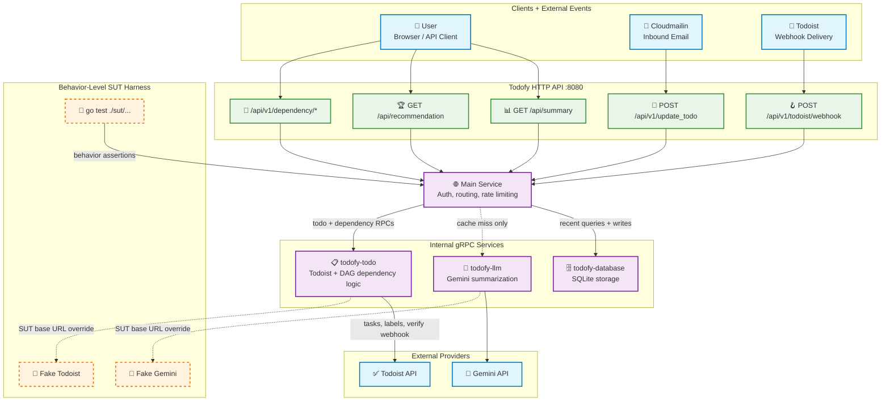
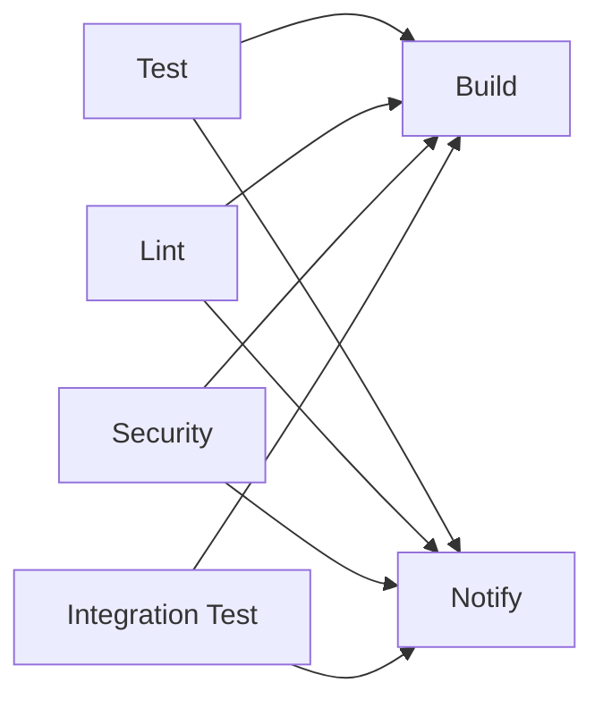

# Todofy - Self-Hosted Task Management Tool

[](https://github.com/ziyixi/todofy/actions/workflows/ci.yml)
[](https://codecov.io/gh/ziyixi/todofy)

Todofy is a self-hosted task management tool designed to help you organize and prioritize your tasks efficiently. It's built as a collection of microservices communicating over gRPC, with email-driven task creation routed to Todoist and Google Gemini-based summarization.

## 🏗️ Architecture


```mermaid
flowchart TB
    subgraph Clients["Clients + External Events"]
        direction LR
        User[👤 User<br/>Browser / API Client]
        Email[📧 Cloudmailin<br/>Inbound Email]
        TodoistEvent[🔔 Todoist<br/>Webhook Delivery]
    end

    subgraph API["Todofy HTTP API :8080"]
        direction LR
        Summary[📊 GET /api/summary]
        Recommend[🏆 GET /api/recommendation]
        UpdateTodo[📝 POST /api/v1/update_todo]
        DependencyOps[🔗 /api/v1/dependency/*]
        Webhook[🪝 POST /api/v1/todoist/webhook]
    end

    Main[🌐 Main Service<br/>Auth, routing, rate limiting]

    subgraph Services["Internal gRPC Services"]
        direction LR
        LLM[🧠 todofy-llm<br/>Gemini summarization]
        Todo[📋 todofy-todo<br/>Todoist + DAG dependency logic]
        DB[🗄️ todofy-database<br/>SQLite storage]
    end

    subgraph Providers["External Providers"]
        direction LR
        Gemini[🤖 Gemini API]
        Todoist[✅ Todoist API]
    end

    subgraph SUT["Behavior-Level SUT Harness"]
        direction LR
        SUTTests[🧪 go test ./sut/...]
        FakeGemini[🧪 Fake Gemini]
        FakeTodoist[🧪 Fake Todoist]
    end

    User --> Summary
    User --> Recommend
    User --> DependencyOps
    Email --> UpdateTodo
    TodoistEvent --> Webhook

    Summary --> Main
    Recommend --> Main
    UpdateTodo --> Main
    DependencyOps --> Main
    Webhook --> Main

    Main -->|recent queries + writes| DB
    Main -.->|cache miss only| LLM
    Main -->|todo + dependency RPCs| Todo

    LLM --> Gemini
    Todo -->|tasks, labels, verify webhook| Todoist

    SUTTests -->|behavior assertions| Main
    LLM -.->|SUT base URL override| FakeGemini
    Todo -.->|SUT base URL override| FakeTodoist

    classDef external fill:#e1f5fe,stroke:#0277bd,stroke-width:2px
    classDef service fill:#f3e5f5,stroke:#7b1fa2,stroke-width:2px
    classDef endpoint fill:#e8f5e8,stroke:#388e3c,stroke-width:2px
    classDef test fill:#fff3e0,stroke:#ef6c00,stroke-width:2px,stroke-dasharray: 5 5

    class User,Email,TodoistEvent,Gemini,Todoist external
    class Main,LLM,Todo,DB service
    class Summary,Recommend,UpdateTodo,DependencyOps,Webhook endpoint
    class SUTTests,FakeGemini,FakeTodoist test
```

## ✨ Features

<details>
<summary><strong>Expand feature list</strong></summary>

* **Task Management:** Core functionality for creating, updating, and managing tasks.
* **LLM Integration:** Leverages Google Gemini models for email summarization with automatic model fallback (via `todofy-llm` service).
* **Cost Controls:** Daily token limit with 24-hour sliding window (default: 3M tokens) to prevent runaway API costs, plus email content truncation (50K character hard limit).
* **Dedup Cache:** SHA-256 hash-based deduplication — identical emails skip the expensive LLM call and reuse the cached summary from the database.
* **Summary API:** `GET /api/summary` returns structured JSON: `summary`, `task_count`, and `time_window_hours`.
* **Task Recommendations:** `GET /api/recommendation?top=N` queries recent 24h tasks, asks the LLM to pick the top-N most important ones (default 3, max 10), and returns structured JSON with rank, title, and reason for each.
* **Todoist-Only Task Population:** Incoming tasks are created in Todoist through `todofy-todo`.
* **Todoist DAG Dependencies:** Supports task-title metadata (`<k:task-key dep:other-key,...>`) and reconcile-driven dependency analysis.
* **Reserved DAG Labels:** Automatically manages `dag_blocked`, `dag_cycle`, `dag_broken_dep`, and `dag_invalid_meta` with minimal label diffs.
* **Manual DAG Operations:** Exposes reconcile, bootstrap-key, status, and issue endpoints under `/api/v1/dependency/*`.
* **Bounded Dependency Sync:** Todoist-backed dependency reads and writes are deadline-bounded so upstream latency does not hang reconcile indefinitely.
* **Best-Effort Dependency Writes:** Reconcile and bootstrap continue past per-task write failures, return partial-success details, and rely on later runs to converge remaining drift.
* **Webhook-as-Hint Flow:** Supports Todoist webhook verification and dirty-mark signaling; scheduled/manual reconcile remains the source of truth.
* **Persistent Storage:** Uses SQLite for storing task data with hash-indexed lookups (via `todofy-database` service).
* **Containerized Services:** All components are containerized using Docker for easy deployment and scaling.
* **Comprehensive Testing:** Unit tests, e2e tests with mock Gemini client injection, and Docker-based integration tests.

</details>

## 📡 API Behavior

<details>
<summary><strong>Expand API behavior and endpoints</strong></summary>

### `GET /api/summary`

Returns a 24-hour summary payload with no task delivery side effect:

```json
{
  "summary": "string",
  "task_count": 3,
  "time_window_hours": 24
}
```

### Dependency Control Endpoints (Basic Auth Required)

* `POST /api/v1/dependency/reconcile` (`?dry_run=true` for analyze-only)
* `POST /api/v1/dependency/bootstrap_keys` (`?dry_run=true` by default)
* `GET /api/v1/dependency/status?task_key=...` (or `todoist_task_id=...`)
* `GET /api/v1/dependency/issues?type=...&task_key=...`
* Reconcile and bootstrap return HTTP `200` with `partial_success`, `failed_update_count`, and `write_failures` when analysis succeeds but one or more Todoist writes fail.
* Dependency read/precondition timeouts surface as HTTP `504`; later runs recompute state and retry any remaining drift.

### Todoist Webhook Endpoint (No Basic Auth)

* `POST /api/v1/todoist/webhook`
* Signature verification is delegated to the Todoist gRPC integration layer.
* Endpoint returns HTTP `200` for delivery compatibility, even when the signature is missing or invalid.
* Rejected deliveries return JSON with `accepted:false`, `reason`, and `details`; only verified deliveries mark graph state dirty.

</details>

## 🧠 LLM Service Details

<details>
<summary><strong>Expand LLM model and cost-control details</strong></summary>

The LLM service uses Google Gemini for email summarization with several cost-control and reliability features:

### Supported Models

Models are tried in priority order for automatic fallback:

1. `gemini-2.5-flash-lite` (fastest, cheapest)
2. `gemini-2.5-flash` (balanced)
3. `gemini-3-flash-preview` (latest)

Additionally, `gemini-2.5-pro` is available when explicitly requested.

### Cost Controls

| Feature | Default | Description |
|---------|---------|-------------|
| Daily token limit | 3,000,000 | 24-hour sliding window; configurable via `--daily-token-limit` flag (0 = unlimited) |
| Email content limit | 50,000 chars | Hard truncation of email body before LLM processing |
| Token counting | Per-request | Content is iteratively truncated (to 90%) until under the per-model token limit (1M tokens) |
| Dedup cache | Always on | SHA-256 hash of `prompt + email content`; duplicate emails return cached summary without LLM call |

### Configuration Flags

| Flag | Default | Description |
|------|---------|-------------|
| `--port` | `50051` | gRPC server port |
| `--gemini-api-key` | (required) | Google Gemini API key |
| `--daily-token-limit` | `3000000` | Max tokens per 24h sliding window (0 = unlimited) |

</details>

## 🛠️ Services

<details>
<summary><strong>Expand per-service reference</strong></summary>

The application is composed of the following services:

1.  **Todofy (Main App)**
    * Description: The primary user-facing application and HTTP API gateway.
    * Dockerfile: `./Dockerfile`
    * Default Port: `8080` (configurable via `PORT` env var)
    * Image: `ghcr.io/ziyixi/todofy:latest`

2.  **LLM Service (`todofy-llm`)**
    * Description: Email summarization via Google Gemini with model fallback and daily token tracking.
    * Dockerfile: `llm/Dockerfile`
    * Default Port: `50051` (configurable via `--port` flag)
    * Image: `ghcr.io/ziyixi/todofy-llm:latest`

3.  **Todo Service (`todofy-todo`)**
    * Description: Manages Todoist integration (create/read/list/update labels/webhook verify) and dependency DAG reconcile services.
    * Dockerfile: `todo/Dockerfile`
    * Default Port: `50052` (configurable via `--port` flag)
    * Image: `ghcr.io/ziyixi/todofy-todo:latest`

4.  **Database Service (`todofy-database`)**
    * Description: Provides database access and management using SQLite. Supports `Write`, `QueryRecent`, and `CheckExist` (hash-based dedup lookup) RPCs.
    * Dockerfile: `database/Dockerfile`
    * Default Port: `50053` (configurable via `PORT` env var)
    * Image: `ghcr.io/ziyixi/todofy-database:latest`

</details>

## 🐳 Deployment Setup

Use the collapsible sections below for operational setup details.

Reference files in repo:
- `env/todofy.env.example` for production-style `env_file` compose setups.
- `env/todofy.test.env` used by `docker-compose.test.yml` in CI and local integration runs.
- `env/todofy.sut.env` used by `docker-compose.sut.yml` for behavior-level system-under-test coverage.

<details>
<summary><strong>Env precedence and shared-file rules</strong></summary>

- In Docker Compose, a service's `environment` values override the same keys from `env_file`.
- Values from `env_file` override image defaults set by Dockerfile `ENV`.
- If a key is missing from both, the app's internal default/flag value is used.

When one shared `env_file` is reused across all services, set service-specific `PORT` in each service `environment` block (`8080`, `50051`, `50052`, `50053`) to avoid accidental port reuse.

</details>

<details>
<summary><strong>Required environment variables</strong></summary>

### `todofy` (main HTTP service)

| Variable | Required | Example |
|----------|----------|---------|
| `PORT` | Yes | `8080` |
| `ALLOWED_USERS` | Yes | `admin:strong-password` |
| `DATABASE_PATH` | Yes | `/tmp/todofy.db` |
| `LLMAddr` | Yes | `todofy-llm:50051` |
| `TodoAddr` | Yes | `todofy-todo:50052` |
| `DependencyAddr` | Optional | `todofy-todo:50052` (defaults to `TodoAddr`) |
| `TodoistAddr` | Optional | `todofy-todo:50052` (defaults to `TodoAddr`) |
| `DatabaseAddr` | Yes | `todofy-database:50053` |

### `todofy-llm`

| Variable | Required | Example |
|----------|----------|---------|
| `PORT` | Yes | `50051` |
| `GEMINI_API_KEY` | Yes (for real summarization) | `AIza...` |

### `todofy-todo`

| Variable | Required | Example |
|----------|----------|---------|
| `PORT` | Yes | `50052` |
| `TODOIST_API_KEY` | Yes (for Todoist writes/reads) | `token` |
| `TODOIST_DEFAULT_PROJECT_ID` | Optional | `1234567890` |
| `TODOIST_WEBHOOK_SECRET` | Recommended | `webhook-secret` |
| `DEPENDENCY_RECONCILE_INTERVAL` | Optional | `30m` |
| `DEPENDENCY_WEBHOOK_DEBOUNCE` | Optional | `20s` |
| `DEPENDENCY_GRACE_PERIOD` | Optional | `2m` |
| `DEPENDENCY_RECONCILE_TIMEOUT` | Optional | `2m` |
| `DEPENDENCY_READ_TIMEOUT` | Optional | `45s` |
| `DEPENDENCY_WRITE_TIMEOUT` | Optional | `20s` |
| `DEPENDENCY_ENABLE_SCHEDULER` | Optional | `true` |
| `DEPENDENCY_BOOTSTRAP_EXCLUDED_PROJECT_IDS` | Optional | `1122334455,99887766` |

In the Todoist web app, open the project and read the number in the URL after `/project/`.
Example: `https://app.todoist.com/app/project/2299753711` means project ID `2299753711`.

If you prefer an API fallback, use:

```bash
curl -sS \
  -H "Authorization: Bearer $TODOIST_API_KEY" \
  https://api.todoist.com/api/v1/projects
```

Use that project ID for `TODOIST_DEFAULT_PROJECT_ID`, or join multiple project IDs with commas for `DEPENDENCY_BOOTSTRAP_EXCLUDED_PROJECT_IDS`.

### `todofy-database`

| Variable | Required | Example |
|----------|----------|---------|
| `PORT` | Yes | `50053` |

</details>

<details>
<summary><strong>Example env file (`env/todofy.env`)</strong></summary>

```bash
cp env/todofy.env.example env/todofy.env
```

```dotenv
# Shared values for all services.
# Keep PORT out of this shared file; set it per service in docker-compose.
ALLOWED_USERS=admin:change-me
DATABASE_PATH=/tmp/todofy.db
LLMAddr=todofy-llm:50051
TodoAddr=todofy-todo:50052
DependencyAddr=todofy-todo:50052
TodoistAddr=todofy-todo:50052
DatabaseAddr=todofy-database:50053

# LLM service
GEMINI_API_KEY=replace-with-real-key

# Todo service
TODOIST_API_KEY=replace-with-real-token
# In the Todoist web app, open the project and read the number in the URL after `/project/`.
# Example: https://app.todoist.com/app/project/2299753711 -> 2299753711
# You can also use the Projects API as a fallback:
# curl -sS -H "Authorization: Bearer $TODOIST_API_KEY" https://api.todoist.com/api/v1/projects
TODOIST_DEFAULT_PROJECT_ID=
TODOIST_WEBHOOK_SECRET=replace-with-real-secret
DEPENDENCY_RECONCILE_INTERVAL=30m
DEPENDENCY_WEBHOOK_DEBOUNCE=20s
DEPENDENCY_GRACE_PERIOD=2m
DEPENDENCY_RECONCILE_TIMEOUT=2m
DEPENDENCY_READ_TIMEOUT=45s
DEPENDENCY_WRITE_TIMEOUT=20s
DEPENDENCY_ENABLE_SCHEDULER=true
DEPENDENCY_BOOTSTRAP_EXCLUDED_PROJECT_IDS=
```

</details>

<details>
<summary><strong>Integration test compose (`docker-compose.test.yml`)</strong></summary>

`docker-compose.test.yml` reads `env/todofy.test.env` directly. This is the single source used by GitHub Actions integration tests.

Run locally:

```bash
make test-integration
```

`make test-integration` mirrors the CI health, auth, webhook, and gRPC connectivity checks against `docker-compose.test.yml` and tears the stack down automatically.

</details>

<details>
<summary><strong>System-Under-Test compose (`docker-compose.sut.yml`)</strong></summary>

`docker-compose.sut.yml` is the behavior-level integration harness.
It keeps the main app, `todofy-llm`, `todofy-todo`, and `todofy-database` real, while replacing only the true external providers with in-repo fakes:

- fake Gemini at `sut/fakes/gemini`
- fake Todoist at `sut/fakes/todoist`

The shared env file is `env/todofy.sut.env`.
By default it:

- points Gemini traffic at the fake Gemini base URL
- points Todoist traffic at the fake Todoist base URL
- disables the main app rate limiter for deterministic test runs
- disables dependency background scheduling so tests can drive reconcile behavior explicitly
- uses short dependency read/write deadlines so timeout handling can be exercised quickly

Host-exposed ports used by the SUT harness:

- `10013` -> main HTTP API (`todofy-sut`)
- `10053` -> real database gRPC (`todofy-database-sut`)
- `18081` -> fake Gemini admin API
- `18082` -> fake Todoist admin API

Run locally:

```bash
docker compose -f docker-compose.sut.yml build
docker compose -f docker-compose.sut.yml up -d
make test-sut
docker compose -f docker-compose.sut.yml down -v
```

`make test-sut` runs `TODOFY_RUN_SUT=1 go test -v ./sut/...`.

The SUT suite covers endpoint behavior such as:

- `POST /api/v1/update_todo` with cache miss, cache hit, and external failure paths
- `GET /api/summary`
- `GET /api/recommendation`
- dependency reconcile, bootstrap, status, and issue endpoints
- dependency partial-success and timeout recovery behavior
- Todoist webhook signature handling
- excluded-project bootstrap behavior via `DEPENDENCY_BOOTSTRAP_EXCLUDED_PROJECT_IDS`

</details>

<details>
<summary><strong>Docker Compose example (Vultr-style, from your real stack pattern)</strong></summary>

```yaml
networks:
  allexport:

services:
  todofy:
    image: ghcr.io/ziyixi/todofy:latest
    container_name: todofy
    ports:
      - "10003:8080"
    restart: always
    env_file: ./env/todofy.env
    environment:
      PORT: "8080"
    depends_on:
      - todofy-llm
      - todofy-todo
      - todofy-database
    networks:
      - allexport

  todofy-llm:
    image: ghcr.io/ziyixi/todofy-llm:latest
    container_name: todofy-llm
    restart: always
    env_file: ./env/todofy.env
    environment:
      PORT: "50051"
    networks:
      - allexport

  todofy-todo:
    image: ghcr.io/ziyixi/todofy-todo:latest
    container_name: todofy-todo
    restart: always
    env_file: ./env/todofy.env
    environment:
      PORT: "50052"
    networks:
      - allexport

  todofy-database:
    image: ghcr.io/ziyixi/todofy-database:latest
    container_name: todofy-database
    restart: always
    env_file: ./env/todofy.env
    environment:
      PORT: "50053"
    volumes:
      - ./data/todofy:/root
    networks:
      - allexport
```

Bring up/down:

```bash
docker compose up -d
docker compose logs -f todofy
docker compose down
```

</details>

<details>
<summary><strong>Equivalent single-container Docker commands</strong></summary>

```bash
docker network create todofy-net

docker run -d --name todofy-llm \
  --network todofy-net \
  --env-file ./env/todofy.env \
  ghcr.io/ziyixi/todofy-llm:latest

docker run -d --name todofy-todo \
  --network todofy-net \
  --env-file ./env/todofy.env \
  ghcr.io/ziyixi/todofy-todo:latest

docker run -d --name todofy-database \
  --network todofy-net \
  --env-file ./env/todofy.env \
  -v "$PWD/data/todofy:/root" \
  ghcr.io/ziyixi/todofy-database:latest

docker run -d --name todofy \
  --network todofy-net \
  --env-file ./env/todofy.env \
  -p 10003:8080 \
  ghcr.io/ziyixi/todofy:latest
```

</details>

## 🔄 CI/CD Pipeline

<details>
<summary><strong>Expand CI/CD workflow details</strong></summary>

The CI/CD pipeline uses GitHub Actions with reusable workflows organized as a dependency graph:


```mermaid
graph LR
    T[Test] --> B[Build]
    L[Lint] --> B
    S[Security] --> B
    I[Integration Test] --> B
    T --> N[Notify]
    L --> N
    S --> N
    I --> N
```

| Workflow | Description |
|----------|-------------|
| **Test** | Runs `go test -race` with coverage, uploads to Codecov |
| **Lint** | Runs `golangci-lint` |
| **Security** | Runs `gosec` with SARIF upload to GitHub Security |
| **Integration Test** | Builds all 4 Docker images and validates with health checks |
| **Build** | Pushes Docker images to GHCR on `main` only when build-relevant files change (or manual dispatch) |
| **Notify** | Reports pass/fail status |

</details>

## 📦 GitHub Packages (GHCR)

<details>
<summary><strong>Expand published image references</strong></summary>

Docker images for each service are automatically built and pushed to GitHub Container Registry (GHCR) by the CI/CD pipeline. You can pull them using:

* `docker pull ghcr.io/ziyixi/todofy:latest`
* `docker pull ghcr.io/ziyixi/todofy-llm:latest`
* `docker pull ghcr.io/ziyixi/todofy-todo:latest`
* `docker pull ghcr.io/ziyixi/todofy-database:latest`

</details>

## 🧪 Testing

<details>
<summary><strong>Expand test commands and coverage scope</strong></summary>

Run all tests:

```bash
go test ./...
```

Run with coverage:

```bash
go test -race -coverprofile=coverage.out -covermode=atomic $(go list ./... | grep -vE '^github.com/ziyixi/todofy/(sut|testutils)(/|$)')
go tool cover -func=coverage.out
```

Reported line coverage excludes `sut/**` and `testutils/**`.
`sut` still runs in its own CI workflow as behavior-level system coverage.
Dependency coverage now includes timeout and partial-success paths in the Todo service, while SUT keeps the HTTP-visible recovery contract covered separately.

The LLM service includes e2e tests with a mock Gemini client (no real API calls or costs), covering:
- Full summarization flow and model fallback
- Daily token limit enforcement and sliding window expiry
- Token usage tracking (with `UsageMetadata` and `CountTokens` fallback)
- Content truncation for oversized inputs
- Error handling (empty responses, client failures, missing API key)

The database service includes tests for:
- `CheckExist` RPC — cache hit, cache miss, empty hash validation, uninitialized DB
- Full integration workflow: create → write (with hash_id) → query → CheckExist verification

The recommendation handler includes tests for:
- No tasks / database error / LLM error handling
- Valid JSON parsing with correct ranks, titles, and reasons
- Markdown code fence stripping (`\`\`\`json ... \`\`\``)
- Fallback when LLM returns plain text instead of JSON
- `?top=N` parameter validation (default 3, range 1-10, invalid values)
- Prompt content verification (correct format string interpolation)
- `task_count` reflects DB entries, not recommendation count

</details>
