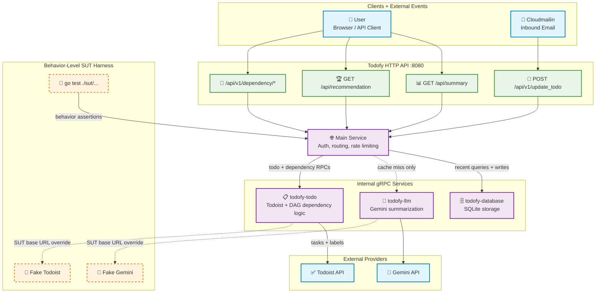
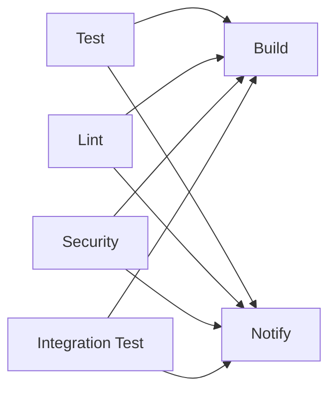

# Todofy - Self-Hosted Task Management Tool

[](https://github.com/ziyixi/todofy/actions/workflows/ci.yml)
[](https://codecov.io/gh/ziyixi/todofy)

Todofy is a self-hosted task management tool designed to help you organize and prioritize your tasks efficiently. It's built as a collection of microservices communicating over gRPC, with email-driven task creation routed to Todoist and Google Gemini-based summarization.

## 🏗️ Architecture


```mermaid
flowchart TB
    subgraph Clients["Clients + External Events"]
        direction LR
        User[👤 User<br/>Browser / API Client]
        Email[📧 Cloudmailin<br/>Inbound Email]
    end

    subgraph API["Todofy HTTP API :8080"]
        direction LR
        Summary[📊 GET /api/summary]
        Recommend[🏆 GET /api/recommendation]
        UpdateTodo[📝 POST /api/v1/update_todo]
        DependencyOps[🔗 /api/v1/dependency/*]
    end

    Main[🌐 Main Service<br/>Auth, routing, rate limiting]

    subgraph Services["Internal gRPC Services"]
        direction LR
        LLM[🧠 todofy-llm<br/>Gemini summarization]
        Todo[📋 todofy-todo<br/>Todoist + DAG dependency logic]
        DB[🗄️ todofy-database<br/>SQLite storage]
    end

    subgraph Providers["External Providers"]
        direction LR
        Gemini[🤖 Gemini API]
        Todoist[✅ Todoist API]
    end

    subgraph SUT["Behavior-Level SUT Harness"]
        direction LR
        SUTTests[🧪 go test ./sut/...]
        FakeGemini[🧪 Fake Gemini]
        FakeTodoist[🧪 Fake Todoist]
    end

    User --> Summary
    User --> Recommend
    User --> DependencyOps
    Email --> UpdateTodo

    Summary --> Main
    Recommend --> Main
    UpdateTodo --> Main
    DependencyOps --> Main

    Main -->|recent queries + writes| DB
    Main -.->|cache miss only| LLM
    Main -->|todo + dependency RPCs| Todo

    LLM --> Gemini
    Todo -->|tasks + labels| Todoist

    SUTTests -->|behavior assertions| Main
    LLM -.->|SUT base URL override| FakeGemini
    Todo -.->|SUT base URL override| FakeTodoist

    classDef external fill:#e1f5fe,stroke:#0277bd,stroke-width:2px
    classDef service fill:#f3e5f5,stroke:#7b1fa2,stroke-width:2px
    classDef endpoint fill:#e8f5e8,stroke:#388e3c,stroke-width:2px
    classDef test fill:#fff3e0,stroke:#ef6c00,stroke-width:2px,stroke-dasharray: 5 5

    class User,Email,Gemini,Todoist external
    class Main,LLM,Todo,DB service
    class Summary,Recommend,UpdateTodo,DependencyOps endpoint
    class SUTTests,FakeGemini,FakeTodoist test
```

## ✨ Features

<details>
<summary><strong>Expand feature list</strong></summary>

* **Task Management:** Core functionality for creating, updating, and managing tasks.
* **LLM Integration:** Leverages Google Gemini models for email summarization with automatic model fallback (via `todofy-llm` service).
* **Cost Controls:** Daily token limit with 24-hour sliding window (default: 3M tokens) to prevent runaway API costs, plus email content truncation (50K character hard limit).
* **Dedup Cache:** SHA-256 hash-based deduplication — identical emails skip the expensive LLM call and reuse the cached summary from the database.
* **Summary API:** `GET /api/summary` returns structured JSON: `summary`, `task_count`, and `time_window_hours`.
* **Task Recommendations:** `GET /api/recommendation?top=N` queries recent 24h tasks, asks the LLM to pick the top-N most important ones (default 3, max 10), and returns structured JSON with rank, title, and reason for each.
* **Todoist-Only Task Population:** Incoming tasks are created in Todoist through `todofy-todo`.
* **Todoist DAG Dependencies:** Supports task-title metadata (`<k:task-key dep:other-key,...>`) and reconcile-driven dependency analysis.
* **Reserved DAG Labels:** Automatically manages `dag_blocked`, `dag_cycle`, `dag_broken_dep`, and `dag_invalid_meta` with minimal label diffs.
* **Manual DAG Operations:** Exposes reconcile, bootstrap-key, clear-metadata, status, and issue endpoints under `/api/v1/dependency/*`.
* **Bounded Dependency Sync:** Todoist-backed dependency reads and writes are deadline-bounded so upstream latency does not hang reconcile indefinitely.
* **Best-Effort Dependency Writes:** Reconcile and bootstrap continue past per-task write failures, return partial-success details, and rely on later runs to converge remaining drift.
* **Automatic Key Bootstrap:** Runs one bootstrap pass on startup and periodic bootstrap by interval (default `24h`).
* **Clear Metadata API:** Supports dry-run and write mode metadata removal while preserving the user-visible task title.
* **Persistent Storage:** Uses SQLite for storing task data with hash-indexed lookups (via `todofy-database` service).
* **Containerized Services:** All components are containerized using Docker for easy deployment and scaling.
* **Comprehensive Testing:** Unit tests, e2e tests with mock Gemini client injection, and Docker-based integration tests.

</details>

## 📡 API Behavior

<details>
<summary><strong>Expand API behavior and endpoints</strong></summary>

### `GET /api/summary`

Returns a 24-hour summary payload with no task delivery side effect:

```json
{
  "summary": "string",
  "task_count": 3,
  "time_window_hours": 24
}
```

### Dependency Control Endpoints (Basic Auth Required)

* `POST /api/v1/dependency/reconcile` (`?dry_run=true` for analyze-only)
* `POST /api/v1/dependency/bootstrap_keys` (`?dry_run=true` by default)
* `POST /api/v1/dependency/clear_metadata` (`?dry_run=true` by default)
* `GET /api/v1/dependency/status?task_key=...` (or `todoist_task_id=...`)
* `GET /api/v1/dependency/issues?type=...&task_key=...`
* Reconcile and bootstrap return HTTP `200` with `partial_success`, `failed_update_count`, and `write_failures` when analysis succeeds but one or more Todoist writes fail.
* Dependency read/precondition timeouts surface as HTTP `504`; later runs recompute state and retry any remaining drift.

</details>

## 🧠 LLM Service Details

<details>
<summary><strong>Expand LLM model and cost-control details</strong></summary>

The LLM service uses Google Gemini for email summarization with several cost-control and reliability features:

### Supported Models

Email summaries, range summaries, and task recommendations leave the model unspecified
and use the LLM service's default fallback order:

1. `gemini-3.8-flash` (default)
2. `gemini-3.7-flash`
3. `gemini-3.5-flash-lite`

Errors or empty responses advance to the next model. If all three fail, the request
returns an error. The response reports the model that actually generated the summary.
An explicit `LLMSummaryRequest.model` selects only that model, with no automatic fallback.

Additional explicit choices are `gemini-3.6-flash`, `gemini-3.5-flash`,
`gemini-3.1-flash-lite`, and `gemini-3.1-pro-preview`.
For compatibility, `gemini-2.5-pro`, `gemini-2.5-flash`, `gemini-2.5-flash-lite`, and
`gemini-3-flash-preview` remain accepted, although their proto enum values are marked
deprecated as project legacy choices. This does not mean Google has shut them down.
Model availability also depends on the Gemini API key/project; see the
[Gemini model catalog](https://ai.google.dev/gemini-api/docs/models).

The model enum is provided by the shared `github.com/ziyixi/protos/go/todofy` Go module,
pinned in `go.mod`; Todofy does not generate its own copy. Update proto sources on the
shared repository's `protobuf` branch, wait for its workflow to publish generated Go
code to `main`, then update this module dependency to that published commit.

### Cost Controls

| Feature | Default | Description |
|---------|---------|-------------|
| Daily token limit | 3,000,000 | 24-hour sliding window; configurable via `--daily-token-limit` flag (0 = unlimited) |
| Email content limit | 50,000 chars | Hard truncation of email body before LLM processing |
| Token counting | Per-request | Content is iteratively truncated (to 90%) until under the per-model token limit (1M tokens) |
| Dedup cache | Always on | SHA-256 hash of `prompt + email content`; duplicate emails return cached summary without LLM call |

### Configuration Flags

| Flag | Default | Description |
|------|---------|-------------|
| `--port` | `50051` | gRPC server port |
| `--gemini-api-key` | (required) | Google Gemini API key |
| `--daily-token-limit` | `3000000` | Max tokens per 24h sliding window (0 = unlimited) |

</details>

## 🛠️ Services

<details>
<summary><strong>Expand per-service reference</strong></summary>

The application is composed of the following services:

1.  **Todofy (Main App)**
    * Description: The primary user-facing application and HTTP API gateway.
    * Dockerfile: `./Dockerfile`
    * Default Port: `8080` (configurable via `PORT` env var)
    * Image: `ghcr.io/ziyixi/todofy:latest`

2.  **LLM Service (`todofy-llm`)**
    * Description: Email summarization via Google Gemini with model fallback and daily token tracking.
    * Dockerfile: `llm/Dockerfile`
    * Default Port: `50051` (configurable via `--port` flag)
    * Image: `ghcr.io/ziyixi/todofy-llm:latest`

3.  **Todo Service (`todofy-todo`)**
    * Description: Manages Todoist integration (create/read/list/update labels) and dependency DAG reconcile services.
    * Dockerfile: `todo/Dockerfile`
    * Default Port: `50052` (configurable via `--port` flag)
    * Image: `ghcr.io/ziyixi/todofy-todo:latest`

4.  **Database Service (`todofy-database`)**
    * Description: Provides database access and management using SQLite. Supports `Write`, `QueryRecent`, and `CheckExist` (hash-based dedup lookup) RPCs.
    * Dockerfile: `database/Dockerfile`
    * Default Port: `50053` (configurable via `PORT` env var)
    * Image: `ghcr.io/ziyixi/todofy-database:latest`

</details>

## 🐳 Deployment Setup

Use the collapsible sections below for operational setup details.

Reference files in repo:
- `env/todofy.env.example` for production-style `env_file` compose setups.
- `env/todofy.test.env` used by `docker-compose.test.yml` in CI and local integration runs.
- `env/todofy.sut.env` used by `docker-compose.sut.yml` for behavior-level system-under-test coverage.

<details>
<summary><strong>Env precedence and shared-file rules</strong></summary>

- In Docker Compose, a service's `environment` values override the same keys from `env_file`.
- Values from `env_file` override image defaults set by Dockerfile `ENV`.
- If a key is missing from both, the app's internal default/flag value is used.

When one shared `env_file` is reused across all services, set service-specific `PORT` in each service `environment` block (`8080`, `50051`, `50052`, `50053`) to avoid accidental port reuse.

</details>

<details>
<summary><strong>Required environment variables</strong></summary>

### `todofy` (main HTTP service)

| Variable | Required | Example |
|----------|----------|---------|
| `PORT` | Yes | `8080` |
| `ALLOWED_USERS` | Yes | `admin:strong-password` |
| `DATABASE_PATH` | Yes | `/tmp/todofy.db` |
| `LLMAddr` | Yes | `todofy-llm:50051` |
| `TodoAddr` | Yes | `todofy-todo:50052` |
| `DependencyAddr` | Optional | `todofy-todo:50052` (defaults to `TodoAddr`) |
| `DatabaseAddr` | Yes | `todofy-database:50053` |
| `TODOFY_MAIL_INBOX_PATH` | Optional | `/var/lib/todofy-mail/inbox.sqlite` |
| `TODOFY_MAIL_WEBHOOK_TOKEN_FILE` | Optional | `/run/secrets/todofy-mail-webhook-token` |
| `TODOFY_MAIL_SOURCE_ID` | Optional | `mail-hero-personal` |
| `TODOFY_MAIL_ATTENTION_REMINDER` | Optional | `true` (default when the inbox is enabled; `false` disables the daily reminder) |

`TODOFY_MAIL_INBOX_PATH`, `TODOFY_MAIL_WEBHOOK_TOKEN_FILE`, and `TODOFY_MAIL_SOURCE_ID` enable the independent Mail Hero consumer together; if any is missing, startup fails rather than expose a partially configured webhook. The inbox path and token file must be absolute. The source ID is a stable logical identity, not the token value. Token rotation keeps the same source ID and the same inbox file. If these variables are absent, Todofy's existing CloudMailin endpoint and startup behavior are unchanged.

The main `todofy` container needs its **own persistent local volume** for `/var/lib/todofy-mail`, plus a read-only token file at `/run/secrets/todofy-mail-webhook-token`; its database gRPC container has a separate SQLite file. Add both mounts before setting the variables, and include the entire inbox directory (including SQLite WAL files) in backup. The token file must contain a random single-line token of at least 32 bytes. Do not commit it, put it in a shared env file, or send it in chat. The new route is `POST /hooks/mail`, expects `mail.received.v1` JSON, `Authorization: Bearer <token>`, and an `Idempotency-Key` equal to the event ID. Prefer a verified HTTPS ingress; an explicitly allowlisted internal HTTP target exposes the Bearer token to that private network. It is not a CloudMailin-format endpoint.

Todofy returns 204 only after the event is committed to the inbox. The same source/event ID with identical bytes returns 204 without rerunning work; the same ID with different bytes returns 409. A background worker checkpoints the rendered summary before calling Todoist. A successful task creation is saved before the legacy summary cache is written. If a Todoist call times out, returns an error, or is interrupted, the event becomes `todo_unknown` and **is never retried automatically**: an external task may already exist. A transient summary failure (`summary_failed` or `llm_client_unavailable`) keeps retrying with backoff capped at about 4 hours and becomes `failed_summary` only after at least 13 attempts **and** 7 days since arrival, so a model outage or exhausted quota does not strand mail after one bad day. A saved event that cannot be decoded or rendered still stops after 13 attempts. The old `/api/v1/update_todo` CloudMailin path remains available, but it has different synchronous semantics and must not be used as Mail Hero's auto-retry target.

The owner's existing BasicAuth credentials can read `GET /api/v1/mail_inbox`, which lists event IDs, processing states, task IDs, safe error codes, and timestamps without email bodies. The default `view=recent` returns the newest 100 events. `view=attention` returns up to 500 events that need the owner, oldest first: every `failed_summary` or `todo_unknown` event, plus any `pending`, `summarizing`, `summarized`, `todo_sending`, or `todo_created` event received more than 6 hours ago. Any other `view` returns 400. Every response also has `counts` (events per state, including zeros), `attention_count`, and `latest_reminder` (the newest daily reminder as `day`, `state`, `task_id`, `attempts`, and `error_code`, or `null`). For `todo_unknown`, inspect Todoist for the `Mail Hero event: <event_id>` footer and then explicitly call `POST /api/v1/mail_inbox/<event_id>/reconcile` with BasicAuth, `X-Todofy-Admin-Action: reconcile-mail-inbox`, and JSON `{"event_id":"<event_id>","resolution":"task_created","task_id":"<actual task id>"}`. If you confirmed that no task exists, use `{"event_id":"<event_id>","resolution":"task_not_created","confirmed_no_task":true}`; this explicitly resumes task creation and can duplicate an undiscovered task. `failed_summary` can be resumed with `resolution: "retry_summary"`. To give up on a `failed_summary` or `todo_unknown` event, for example after handling the mail yourself in Mail Hero, use `{"event_id":"<event_id>","resolution":"dismiss","confirmed_dismiss":true}`: the event becomes `ignored` with error code `dismissed_by_owner`, its payload, summary, and rendered description are cleared, and its event ID/hash stays in the ledger so a redelivery is still deduplicated. Dismiss without `confirmed_dismiss: true` returns 400. The API accepts each transition once and returns 409 if state has already changed or does not allow the resolution.

When `attention_count` is above zero, the worker creates **at most one Todoist reminder task per UTC day**, titled `[Todofy System] Mail Hero：N 封邮件需要处理`. It checks at most every 10 minutes while idle. The description lists up to 20 attention events as event ID, state, error code, and arrival time, plus how many more exist, and repeats the `view=attention` and reconcile steps above. It never includes subjects, addresses, or mail text. The day is claimed in the inbox table `mail_inbox_reminders` before Todoist is called, and the claim stores the exact title and description. Only a failure that cannot have created a task is retried: the todo client is not configured, or the todo service answers `Unavailable`, `InvalidArgument`, or `FailedPrecondition` (`failed`, error code `todo_client_unavailable` or `reminder_create_failed`). It is retried after 1 hour, up to 5 attempts that day, with the stored request unchanged, so the todo service sends the same Todoist `X-Request-Id`. A timeout, cancellation, any other error, or a response without a task ID may hide a created task, so the day becomes `unknown` (`reminder_result_unknown` or `empty_task_id`) and is not retried, like an event's `todo_unknown`. If Todofy stops during the call, the day becomes `unknown` (`interrupted_reminder_call`) on restart. Both risk a missed reminder rather than a duplicate. Every reminder that is not created logs a warning with only the day, attempt, state, and error code; `latest_reminder` in the status response shows the same state. Set `TODOFY_MAIL_ATTENTION_REMINDER=false` to turn it off; an unrecognized boolean value fails startup when the inbox is enabled.

After successful processing, the separate inbox clears its mail payload and rendered description while keeping the event ID/hash ledger for future duplicate requests. The existing Todofy summary database and Todoist task retain their own content under their normal policies. Mail Hero's “delivered” state means only that this inbox committed; it cannot prove later task creation. The legacy summary cache uses a non-unique `HashId` index; the new worker uses an event-scoped `mailhero-v1-` namespace so it does not overwrite CloudMailin cache rows. Cache writes happen only after the task checkpoint, and their retries never repeat the Todoist call. The cache is not treated as the webhook idempotency ledger.

### `todofy-llm`

| Variable | Required | Example |
|----------|----------|---------|
| `PORT` | Yes | `50051` |
| `GEMINI_API_KEY` | Yes (for real summarization) | `AIza...` |

### `todofy-todo`

| Variable | Required | Example |
|----------|----------|---------|
| `PORT` | Yes | `50052` |
| `TODOIST_API_KEY` | Yes (for Todoist writes/reads) | `token` |
| `TODOIST_DEFAULT_PROJECT_ID` | Optional | `1234567890` |
| `DEPENDENCY_RECONCILE_INTERVAL` | Optional | `30m` |
| `DEPENDENCY_BOOTSTRAP_INTERVAL` | Optional | `24h` |
| `DEPENDENCY_GRACE_PERIOD` | Optional | `2m` |
| `DEPENDENCY_RECONCILE_TIMEOUT` | Optional | `2m` |
| `DEPENDENCY_READ_TIMEOUT` | Optional | `45s` |
| `DEPENDENCY_WRITE_TIMEOUT` | Optional | `20s` |
| `DEPENDENCY_ENABLE_SCHEDULER` | Optional | `true` |
| `DEPENDENCY_BOOTSTRAP_EXCLUDED_PROJECT_IDS` | Optional | `1122334455,99887766` |

In the Todoist web app, open the project and read the number in the URL after `/project/`.
Example: `https://app.todoist.com/app/project/2299753711` means project ID `2299753711`.

If you prefer an API fallback, use:

```bash
curl -sS \
  -H "Authorization: Bearer $TODOIST_API_KEY" \
  https://api.todoist.com/api/v1/projects
```

Use that project ID for `TODOIST_DEFAULT_PROJECT_ID`, or join multiple project IDs with commas for `DEPENDENCY_BOOTSTRAP_EXCLUDED_PROJECT_IDS`.

### `todofy-database`

| Variable | Required | Example |
|----------|----------|---------|
| `PORT` | Yes | `50053` |

</details>

<details>
<summary><strong>Example env file (`env/todofy.env`)</strong></summary>

```bash
cp env/todofy.env.example env/todofy.env
```

```dotenv
# Shared values for all services.
# Keep PORT out of this shared file; set it per service in docker-compose.
ALLOWED_USERS=admin:change-me
DATABASE_PATH=/tmp/todofy.db
LLMAddr=todofy-llm:50051
TodoAddr=todofy-todo:50052
DependencyAddr=todofy-todo:50052
DatabaseAddr=todofy-database:50053

# LLM service
GEMINI_API_KEY=replace-with-real-key

# Todo service
TODOIST_API_KEY=replace-with-real-token
# In the Todoist web app, open the project and read the number in the URL after `/project/`.
# Example: https://app.todoist.com/app/project/2299753711 -> 2299753711
# You can also use the Projects API as a fallback:
# curl -sS -H "Authorization: Bearer $TODOIST_API_KEY" https://api.todoist.com/api/v1/projects
TODOIST_DEFAULT_PROJECT_ID=
DEPENDENCY_RECONCILE_INTERVAL=30m
DEPENDENCY_BOOTSTRAP_INTERVAL=24h
DEPENDENCY_GRACE_PERIOD=2m
DEPENDENCY_RECONCILE_TIMEOUT=2m
DEPENDENCY_READ_TIMEOUT=45s
DEPENDENCY_WRITE_TIMEOUT=20s
DEPENDENCY_ENABLE_SCHEDULER=true
DEPENDENCY_BOOTSTRAP_EXCLUDED_PROJECT_IDS=
```

</details>

<details>
<summary><strong>Integration test compose (`docker-compose.test.yml`)</strong></summary>

`docker-compose.test.yml` reads `env/todofy.test.env` directly. This is the single source used by GitHub Actions integration tests.

Run locally:

```bash
make test-integration
```

`make test-integration` mirrors the CI health, auth, dependency-route auth, and gRPC connectivity checks against `docker-compose.test.yml` and tears the stack down automatically.

</details>

<details>
<summary><strong>System-Under-Test compose (`docker-compose.sut.yml`)</strong></summary>

`docker-compose.sut.yml` is the behavior-level integration harness.
It keeps the main app, `todofy-llm`, `todofy-todo`, and `todofy-database` real, while replacing only the true external providers with in-repo fakes:

- fake Gemini at `sut/fakes/gemini`
- fake Todoist at `sut/fakes/todoist`

The shared env file is `env/todofy.sut.env`.
By default it:

- points Gemini traffic at the fake Gemini base URL
- points Todoist traffic at the fake Todoist base URL
- disables the main app rate limiter for deterministic test runs
- disables dependency background scheduling so API scenarios exclusively own the fake provider state
- uses short dependency read/write deadlines so timeout handling can be exercised quickly

Host-exposed ports used by the SUT harness:

- `10013` -> main HTTP API (`todofy-sut`)
- `10053` -> real database gRPC (`todofy-database-sut`)
- `18081` -> fake Gemini admin API
- `18082` -> fake Todoist admin API

Run the API suite locally:

```bash
docker compose -f docker-compose.sut.yml build
docker compose -f docker-compose.sut.yml up -d --wait --wait-timeout 180
make test-sut
docker compose -f docker-compose.sut.yml down -v
```

`make test-sut` selects `TODOFY_SUT_SUITE=api` and runs with `-count=1` to bypass Go's test cache.
Use `make test-sut SUT_TEST_COUNT=3` to repeat the API scenarios, including exact timeout/retry write-count assertions.

After tearing down the API stack, run periodic scheduler coverage with fresh containers:

```bash
docker compose -f docker-compose.sut.yml -f docker-compose.sut-scheduler.yml up -d --build --wait --wait-timeout 180
make test-sut-scheduler
docker compose -f docker-compose.sut.yml -f docker-compose.sut-scheduler.yml down -v
```

The scheduler override enables scheduling only for `todofy-todo-sut`, retaining the 15-second bootstrap interval.
`make test-sut-scheduler` selects `TODOFY_SUT_SUITE=scheduler` and runs only
`TestSUTDependencySchedulerIntegration`, which verifies two automatic writes without a manual bootstrap request.
Do not run the suites concurrently against the same stack or enable scheduling for API tests: background writes
can consume queued fake responses or change task metadata between a timed-out request and its retry.
GitHub Actions runs the suites on separate fresh runners, repeating API coverage three times and scheduler coverage once.

The SUT suite covers endpoint behavior such as:

- `POST /api/v1/update_todo` with cache miss, cache hit, and external failure paths
- `GET /api/summary`
- `GET /api/recommendation`
- dependency reconcile, bootstrap, clear-metadata, status, and issue endpoints
- periodic dependency auto-bootstrap behavior
- dependency partial-success and timeout recovery behavior
- excluded-project bootstrap behavior via `DEPENDENCY_BOOTSTRAP_EXCLUDED_PROJECT_IDS`

</details>

<details>
<summary><strong>Docker Compose example (Vultr-style, from your real stack pattern)</strong></summary>

```yaml
networks:
  allexport:

services:
  todofy:
    image: ghcr.io/ziyixi/todofy:latest
    container_name: todofy
    ports:
      - "10003:8080"
    restart: always
    env_file: ./env/todofy.env
    environment:
      PORT: "8080"
    # Add these only when enabling the optional Mail Hero inbox above.
    # volumes:
    #   - ./data/todofy-mail:/var/lib/todofy-mail
    #   - ./secrets/todofy-mail-webhook-token:/run/secrets/todofy-mail-webhook-token:ro
    depends_on:
      - todofy-llm
      - todofy-todo
      - todofy-database
    networks:
      - allexport

  todofy-llm:
    image: ghcr.io/ziyixi/todofy-llm:latest
    container_name: todofy-llm
    restart: always
    env_file: ./env/todofy.env
    environment:
      PORT: "50051"
    networks:
      - allexport

  todofy-todo:
    image: ghcr.io/ziyixi/todofy-todo:latest
    container_name: todofy-todo
    restart: always
    env_file: ./env/todofy.env
    environment:
      PORT: "50052"
    networks:
      - allexport

  todofy-database:
    image: ghcr.io/ziyixi/todofy-database:latest
    container_name: todofy-database
    restart: always
    env_file: ./env/todofy.env
    environment:
      PORT: "50053"
    volumes:
      - ./data/todofy:/root
    networks:
      - allexport
```

Bring up/down:

```bash
docker compose up -d
docker compose logs -f todofy
docker compose down
```

</details>

<details>
<summary><strong>Equivalent single-container Docker commands</strong></summary>

```bash
docker network create todofy-net

docker run -d --name todofy-llm \
  --network todofy-net \
  --env-file ./env/todofy.env \
  ghcr.io/ziyixi/todofy-llm:latest

docker run -d --name todofy-todo \
  --network todofy-net \
  --env-file ./env/todofy.env \
  ghcr.io/ziyixi/todofy-todo:latest

docker run -d --name todofy-database \
  --network todofy-net \
  --env-file ./env/todofy.env \
  -v "$PWD/data/todofy:/root" \
  ghcr.io/ziyixi/todofy-database:latest

docker run -d --name todofy \
  --network todofy-net \
  --env-file ./env/todofy.env \
  -p 10003:8080 \
  ghcr.io/ziyixi/todofy:latest
```

</details>

## 🔄 CI/CD Pipeline

<details>
<summary><strong>Expand CI/CD workflow details</strong></summary>

The CI/CD pipeline uses GitHub Actions with reusable workflows organized as a dependency graph:


```mermaid
graph LR
    T[Test] --> B[Build]
    L[Lint] --> B
    S[Security] --> B
    I[Integration Test] --> B
    T --> N[Notify]
    L --> N
    S --> N
    I --> N
```

| Workflow | Description |
|----------|-------------|
| **Test** | Runs `go test -race` with coverage, uploads to Codecov |
| **Lint** | Runs `golangci-lint` |
| **Security** | Runs `gosec` with SARIF upload to GitHub Security |
| **Integration Test** | Builds all 4 Docker images and validates with health checks |
| **Build** | Pushes Docker images to GHCR on `main` only when build-relevant files change (or manual dispatch) |
| **Notify** | Reports pass/fail status |

</details>

## 📦 GitHub Packages (GHCR)

<details>
<summary><strong>Expand published image references</strong></summary>

Docker images for each service are automatically built and pushed to GitHub Container Registry (GHCR) by the CI/CD pipeline. You can pull them using:

* `docker pull ghcr.io/ziyixi/todofy:latest`
* `docker pull ghcr.io/ziyixi/todofy-llm:latest`
* `docker pull ghcr.io/ziyixi/todofy-todo:latest`
* `docker pull ghcr.io/ziyixi/todofy-database:latest`

</details>

## 🧪 Testing

<details>
<summary><strong>Expand test commands and coverage scope</strong></summary>

Run all tests:

```bash
go test ./...
```

Run with coverage:

```bash
go test -race -coverprofile=coverage.out -covermode=atomic $(go list ./... | grep -vE '^github.com/ziyixi/todofy/(sut|testutils)(/|$)')
go tool cover -func=coverage.out
```

Reported line coverage excludes `sut/**` and `testutils/**`.
`sut` still runs in its own CI workflow as behavior-level system coverage.
Dependency coverage now includes timeout and partial-success paths in the Todo service, while SUT keeps the HTTP-visible recovery contract covered separately.

The LLM service includes e2e tests with a mock Gemini client (no real API calls or costs), covering:
- Gemini 3.8 Flash default selection, ordered 3.7 / 3.5 Flash Lite fallback and exhaustion
- Explicit model selection without fallback (including legacy model compatibility)
- Daily token limit enforcement and sliding window expiry
- Token usage tracking (with `UsageMetadata` and `CountTokens` fallback)
- Content truncation for oversized inputs
- Error handling (empty responses, client failures, missing API key)

The database service includes tests for:
- `CheckExist` RPC — cache hit, cache miss, empty hash validation, uninitialized DB
- Full integration workflow: create → write (with hash_id) → query → CheckExist verification

The recommendation handler includes tests for:
- No tasks / database error / LLM error handling
- Valid JSON parsing with correct ranks, titles, and reasons
- Shared server-default model selection and reporting the actual fallback model
- Markdown code fence stripping (`\`\`\`json ... \`\`\``)
- Fallback when LLM returns plain text instead of JSON
- `?top=N` parameter validation (default 3, range 1-10, invalid values)
- Prompt content verification (correct format string interpolation)
- `task_count` reflects DB entries, not recommendation count

</details>
