# Todofy - Self-Hosted Task Management Tool

[](https://github.com/ziyixi/todofy/actions/workflows/ci.yml)
[](https://codecov.io/gh/ziyixi/todofy)

Todofy is a self-hosted task management tool designed to help you organize and prioritize your tasks efficiently. It's built as a collection of microservices communicating over gRPC, with email-driven task creation powered by Google Gemini LLM summarization.

## 🏗️ Architecture

```mermaid
graph TB
    %% External systems and users
    User[👤 User<br/>HTTP Client]
    Email[📧 Email System<br/>Cloudmailin Webhook]
    
    %% External services
    Gemini[🤖 Google Gemini<br/>LLM API]
    Mailjet[📬 Mailjet<br/>Email Service]
    Notion[📝 Notion<br/>Database API]
    Todoist[✅ Todoist<br/>Task Management API]
    
    %% Main HTTP Server
    Main[🌐 Todofy Main Server<br/>HTTP REST API<br/>Port: 8080<br/>Basic Auth + Rate Limiting]
    
    %% Microservices
    LLM[🧠 LLM Service<br/>gRPC Server<br/>Port: 50051]
    Todo[📋 Todo Service<br/>gRPC Server<br/>Port: 50052]
    DB[🗄️ Database Service<br/>gRPC Server<br/>Port: 50053<br/>SQLite Backend]
    
    %% API endpoints
    Summary[📊 /api/summary<br/>GET endpoint]
    UpdateTodo[📝 /api/v1/update_todo<br/>POST endpoint]
    
    %% Data flow connections
    User -->|HTTPS GET| Summary
    Email -->|Webhook POST| UpdateTodo
    
    Summary --> Main
    UpdateTodo --> Main
    
    Main -->|gRPC Health Check| LLM
    Main -->|gRPC Health Check| Todo  
    Main -->|gRPC Health Check| DB
    
    Main -->|LLMSummaryRequest| LLM
    Main -->|TodoRequest| Todo
    Main -->|DatabaseQuery/Insert| DB
    
    LLM -->|API Calls| Gemini
    Todo -->|Email Send| Mailjet
    Todo -->|Task Creation| Notion
    Todo -->|Task Creation| Todoist
    
    %% Service descriptions
    Main -.->|Container| MainContainer[🐳 ghcr.io/ziyixi/todofy:latest]
    LLM -.->|Container| LLMContainer[🐳 ghcr.io/ziyixi/todofy-llm:latest]
    Todo -.->|Container| TodoContainer[🐳 ghcr.io/ziyixi/todofy-todo:latest] 
    DB -.->|Container| DBContainer[🐳 ghcr.io/ziyixi/todofy-database:latest]
    
    %% Styling
    classDef external fill:#e1f5fe,stroke:#0277bd,stroke-width:2px
    classDef service fill:#f3e5f5,stroke:#7b1fa2,stroke-width:2px
    classDef endpoint fill:#e8f5e8,stroke:#388e3c,stroke-width:2px
    classDef container fill:#fff3e0,stroke:#f57c00,stroke-width:2px,stroke-dasharray: 5 5
    
    class User,Email,Gemini,Mailjet,Notion,Todoist external
    class Main,LLM,Todo,DB service
    class Summary,UpdateTodo endpoint
    class MainContainer,LLMContainer,TodoContainer,DBContainer container
```



## ✨ Features

* **Task Management:** Core functionality for creating, updating, and managing tasks.
* **LLM Integration:** Leverages Google Gemini models for email summarization with automatic model fallback (via `todofy-llm` service).
* **Cost Controls:** Daily token limit with 24-hour sliding window (default: 3M tokens) to prevent runaway API costs, plus email content truncation (50K character hard limit).
* **Email/API Task Population:** Allows tasks to be populated or managed via email or API interactions (via `todofy-todo` service).
* **Persistent Storage:** Uses SQLite for storing task data (via `todofy-database` service).
* **Containerized Services:** All components are containerized using Docker for easy deployment and scaling.
* **Comprehensive Testing:** Unit tests, e2e tests with mock Gemini client injection, and Docker-based integration tests.

## 🧠 LLM Service Details

The LLM service uses Google Gemini for email summarization with several cost-control and reliability features:

### Supported Models

Models are tried in priority order for automatic fallback:

1. `gemini-2.5-flash-lite` (fastest, cheapest)
2. `gemini-2.5-flash` (balanced)
3. `gemini-3-flash-preview` (latest)

Additionally, `gemini-2.5-pro` is available when explicitly requested.

### Cost Controls

| Feature | Default | Description |
|---------|---------|-------------|
| Daily token limit | 3,000,000 | 24-hour sliding window; configurable via `--daily-token-limit` flag (0 = unlimited) |
| Email content limit | 50,000 chars | Hard truncation of email body before LLM processing |
| Token counting | Per-request | Content is iteratively truncated (to 90%) until under the per-model token limit (1M tokens) |

### Configuration Flags

| Flag | Default | Description |
|------|---------|-------------|
| `--port` | `50051` | gRPC server port |
| `--gemini-api-key` | (required) | Google Gemini API key |
| `--daily-token-limit` | `3000000` | Max tokens per 24h sliding window (0 = unlimited) |

## 🛠️ Services

The application is composed of the following services:

1.  **Todofy (Main App)**
    * Description: The primary user-facing application and HTTP API gateway.
    * Dockerfile: `./Dockerfile`
    * Default Port: `8080` (configurable via `PORT` env var)
    * Image: `ghcr.io/ziyixi/todofy:latest`

2.  **LLM Service (`todofy-llm`)**
    * Description: Email summarization via Google Gemini with model fallback and daily token tracking.
    * Dockerfile: `llm/Dockerfile`
    * Default Port: `50051` (configurable via `--port` flag)
    * Image: `ghcr.io/ziyixi/todofy-llm:latest`

3.  **Todo Service (`todofy-todo`)**
    * Description: Manages task creation via Todoist, Notion, and email (Mailjet).
    * Dockerfile: `todo/Dockerfile`
    * Default Port: `50052` (configurable via `PORT` env var)
    * Image: `ghcr.io/ziyixi/todofy-todo:latest`

4.  **Database Service (`todofy-database`)**
    * Description: Provides database access and management using SQLite.
    * Dockerfile: `database/Dockerfile`
    * Default Port: `50053` (configurable via `PORT` env var)
    * Image: `ghcr.io/ziyixi/todofy-database:latest`

## 🔄 CI/CD Pipeline

The CI/CD pipeline uses GitHub Actions with reusable workflows organized as a dependency graph:


| Workflow | Description |
|----------|-------------|
| **Test** | Runs `go test -race` with coverage, uploads to Codecov |
| **Lint** | Runs `golangci-lint` |
| **Security** | Runs `gosec` with SARIF upload to GitHub Security |
| **Integration Test** | Builds all 4 Docker images and validates with health checks |
| **Build** | Pushes Docker images to GHCR (main branch only) |
| **Notify** | Reports pass/fail status |

## 📦 GitHub Packages (GHCR)

Docker images for each service are automatically built and pushed to GitHub Container Registry (GHCR) by the CI/CD pipeline. You can pull them using:

* `docker pull ghcr.io/ziyixi/todofy:latest`
* `docker pull ghcr.io/ziyixi/todofy-llm:latest`
* `docker pull ghcr.io/ziyixi/todofy-todo:latest`
* `docker pull ghcr.io/ziyixi/todofy-database:latest`

## 🧪 Testing

Run all tests:

```bash
go test ./...
```

Run with coverage:

```bash
go test -race -coverprofile=coverage.out -covermode=atomic ./...
go tool cover -func=coverage.out
```

The LLM service includes e2e tests with a mock Gemini client (no real API calls or costs), covering:
- Full summarization flow and model fallback
- Daily token limit enforcement and sliding window expiry
- Token usage tracking (with `UsageMetadata` and `CountTokens` fallback)
- Content truncation for oversized inputs
- Error handling (empty responses, client failures, missing API key)
