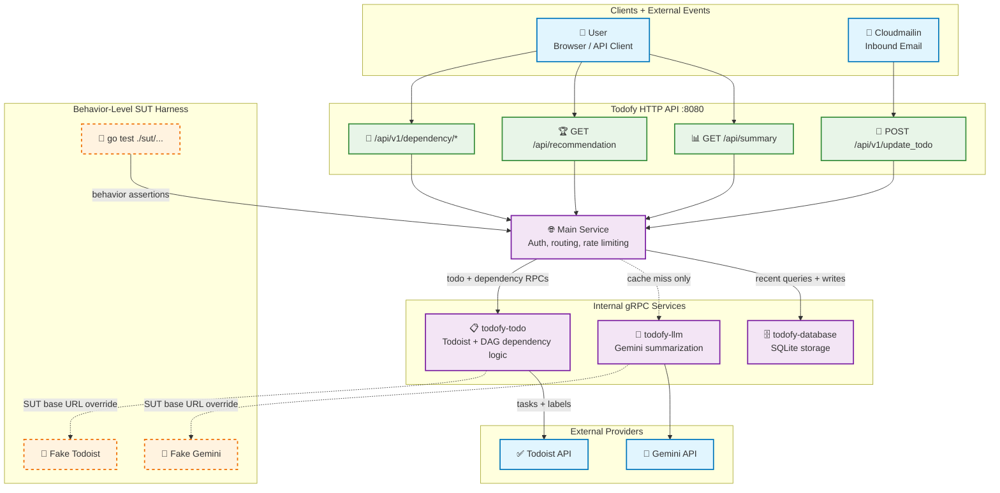

```mermaid
flowchart TB
    subgraph Clients["Clients + External Events"]
        direction LR
        User[👤 User<br/>Browser / API Client]
        Email[📧 Cloudmailin<br/>Inbound Email]
    end

    subgraph API["Todofy HTTP API :8080"]
        direction LR
        Summary[📊 GET /api/summary]
        Recommend[🏆 GET /api/recommendation]
        UpdateTodo[📝 POST /api/v1/update_todo]
        DependencyOps[🔗 /api/v1/dependency/*]
    end

    Main[🌐 Main Service<br/>Auth, routing, rate limiting]

    subgraph Services["Internal gRPC Services"]
        direction LR
        LLM[🧠 todofy-llm<br/>Gemini summarization]
        Todo[📋 todofy-todo<br/>Todoist + DAG dependency logic]
        DB[🗄️ todofy-database<br/>SQLite storage]
    end

    subgraph Providers["External Providers"]
        direction LR
        Gemini[🤖 Gemini API]
        Todoist[✅ Todoist API]
    end

    subgraph SUT["Behavior-Level SUT Harness"]
        direction LR
        SUTTests[🧪 go test ./sut/...]
        FakeGemini[🧪 Fake Gemini]
        FakeTodoist[🧪 Fake Todoist]
    end

    User --> Summary
    User --> Recommend
    User --> DependencyOps
    Email --> UpdateTodo

    Summary --> Main
    Recommend --> Main
    UpdateTodo --> Main
    DependencyOps --> Main

    Main -->|recent queries + writes| DB
    Main -.->|cache miss only| LLM
    Main -->|todo + dependency RPCs| Todo

    LLM --> Gemini
    Todo -->|tasks + labels| Todoist

    SUTTests -->|behavior assertions| Main
    LLM -.->|SUT base URL override| FakeGemini
    Todo -.->|SUT base URL override| FakeTodoist

    classDef external fill:#e1f5fe,stroke:#0277bd,stroke-width:2px
    classDef service fill:#f3e5f5,stroke:#7b1fa2,stroke-width:2px
    classDef endpoint fill:#e8f5e8,stroke:#388e3c,stroke-width:2px
    classDef test fill:#fff3e0,stroke:#ef6c00,stroke-width:2px,stroke-dasharray: 5 5

    class User,Email,Gemini,Todoist external
    class Main,LLM,Todo,DB service
    class Summary,Recommend,UpdateTodo,DependencyOps endpoint
    class SUTTests,FakeGemini,FakeTodoist test
```

**Architecture Overview:**

- **Main HTTP Server (Port 8080)**: REST API with Basic Authentication and Rate Limiting
- **LLM Service (Port 50051)**: Handles AI summarization via Google Gemini
- **Todo Service (Port 50052)**: Manages Todoist task operations and dependency DAG behavior
- **Database Service (Port 50053)**: SQLite database operations via gRPC
- **SUT Harness**: Runs behavior-level tests against real internal services with fake external providers

**Key Features:**
- 📧 **Email-to-Todo**: Inbound email payloads are summarized and converted into Todoist tasks
- 📊 **Summary API**: Returns JSON summaries of recent tasks with task counts
- 🔁 **Dependency Scheduler**: Startup + periodic bootstrap and reconcile keep DAG metadata and labels converged
- 🔗 **Dependency APIs**: Reconcile/bootstrap/clear-metadata/status/issues endpoints under `/api/v1/dependency/*`
- 🐳 **Containerized**: All services available as Docker containers via GitHub Container Registry
- 🔒 **Security**: Basic authentication, rate limiting, and health checks
