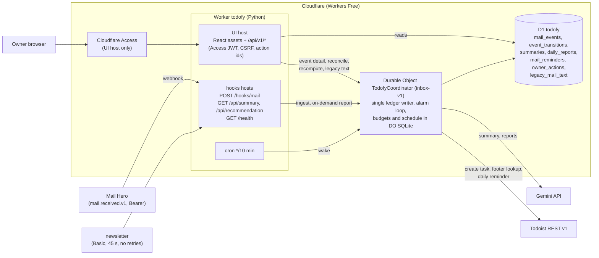
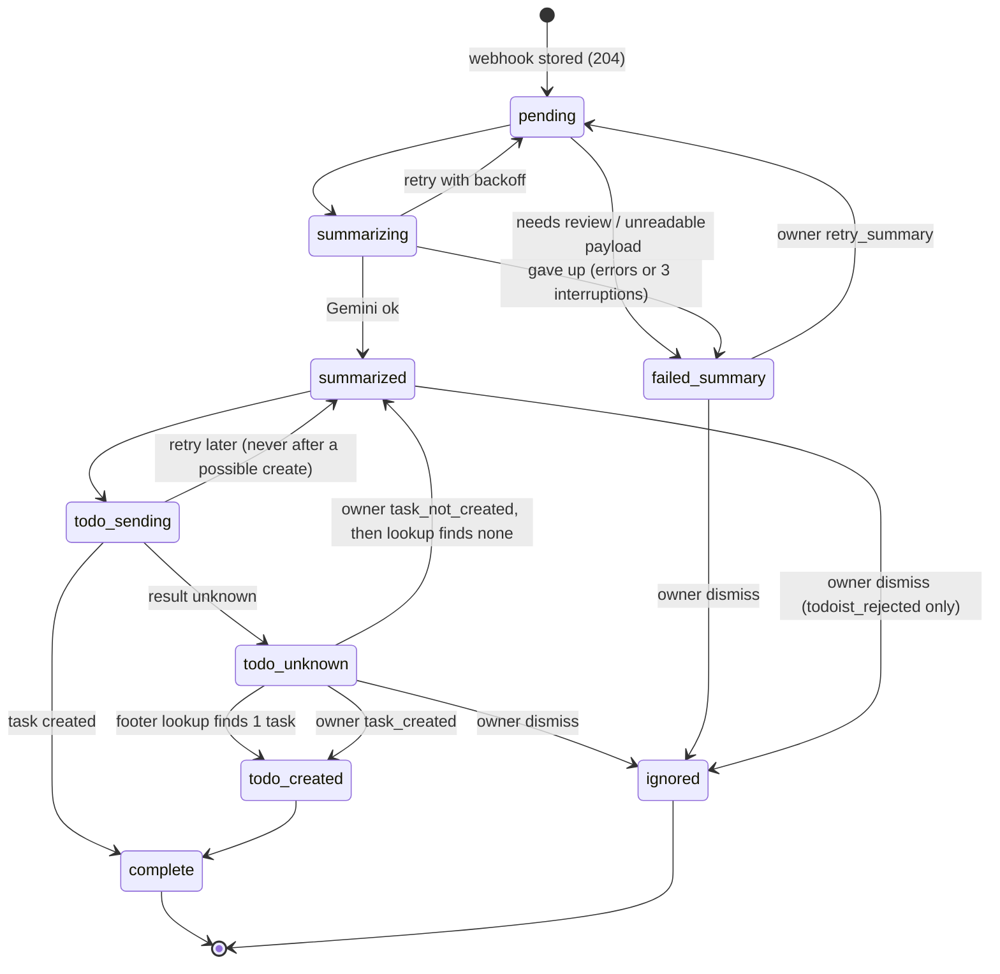

# Todofy architecture

One Cloudflare Worker (Python) with one SQLite-backed Durable Object and one D1 database, on the
Workers Free plan. Mail Hero delivers each received mail as a `mail.received.v1` webhook; Todofy
summarizes it with Gemini and creates one Todoist task, and serves a daily summary and recommendation
to the newsletter. The owner UI is a React app served from the same Worker behind Cloudflare Access.

```mermaid
flowchart LR
    MH["Mail Hero<br/>(mail.received.v1, Bearer)"]
    NL["newsletter<br/>(Basic, 45 s, no retries)"]
    Owner["Owner browser"]

    subgraph CF["Cloudflare (Workers Free)"]
        Access["Cloudflare Access<br/>(UI host only)"]
        subgraph W["Worker todofy (Python)"]
            Hooks["hooks hosts<br/>POST /hooks/mail<br/>GET /api/summary, /api/recommendation<br/>GET /health"]
            OwnerAPI["UI host<br/>React assets + /api/v1/*<br/>(Access JWT, CSRF, action ids)"]
            Cron["cron */10 min"]
        end
        DO["Durable Object TodofyCoordinator (inbox-v1)<br/>single ledger writer, alarm loop,<br/>budgets and schedule in DO SQLite"]
        D1[("D1 todofy<br/>mail_events, event_transitions,<br/>summaries, daily_reports,<br/>mail_reminders, owner_actions,<br/>legacy_mail_text")]
    end

    Gemini["Gemini API"]
    Todoist["Todoist REST v1"]

    MH -->|webhook| Hooks
    NL --> Hooks
    Owner --> Access --> OwnerAPI
    Hooks -->|ingest, on-demand report| DO
    OwnerAPI -->|reads| D1
    OwnerAPI -->|event detail, reconcile,<br/>recompute, legacy text| DO
    Cron -->|wake| DO
    DO --> D1
    DO -->|summary, reports| Gemini
    DO -->|create task, footer lookup,<br/>daily reminder| Todoist
```

Event lifecycle (one ledger step per alarm; every step is a compare-and-set on `(state, version)`):

```mermaid
stateDiagram-v2
    [*] --> pending: webhook stored (204)
    pending --> summarizing
    pending --> failed_summary: needs review / unreadable payload
    summarizing --> summarized: Gemini ok
    summarizing --> pending: retry with backoff
    summarizing --> failed_summary: gave up (errors or 3 interruptions)
    summarized --> todo_sending
    todo_sending --> complete: task created
    todo_sending --> summarized: retry later (never after a possible create)
    todo_sending --> todo_unknown: result unknown
    todo_unknown --> todo_created: footer lookup finds 1 task
    todo_created --> complete
    todo_unknown --> summarized: owner task_not_created, then lookup finds none
    todo_unknown --> todo_created: owner task_created
    failed_summary --> pending: owner retry_summary
    todo_unknown --> ignored: owner dismiss
    failed_summary --> ignored: owner dismiss
    summarized --> ignored: owner dismiss (todoist_rejected only)
    complete --> [*]
    ignored --> [*]
```
