```mermaid
graph TB
    %% External systems and users
    User[👤 User<br/>HTTP Client]
    Email[📧 Email System<br/>Cloudmailin Webhook]
    
    %% External services
    Gemini[🤖 Google Gemini<br/>LLM API]
    Mailjet[📬 Mailjet<br/>Email Service]
    Notion[📝 Notion<br/>Database API]
    Todoist[✅ Todoist<br/>Task Management API]
    
    %% Main HTTP Server
    Main[🌐 Todofy Main Server<br/>HTTP REST API<br/>Port: 8080<br/>Basic Auth + Rate Limiting]
    
    %% Microservices
    LLM[🧠 LLM Service<br/>gRPC Server<br/>Port: 50051]
    Todo[📋 Todo Service<br/>gRPC Server<br/>Port: 50052]
    DB[🗄️ Database Service<br/>gRPC Server<br/>Port: 50053<br/>SQLite Backend]
    
    %% API endpoints
    Summary[📊 /api/summary<br/>GET endpoint]
    UpdateTodo[📝 /api/v1/update_todo<br/>POST endpoint]
    
    %% Data flow connections
    User -->|HTTPS GET| Summary
    Email -->|Webhook POST| UpdateTodo
    
    Summary --> Main
    UpdateTodo --> Main
    
    Main -->|gRPC Health Check| LLM
    Main -->|gRPC Health Check| Todo  
    Main -->|gRPC Health Check| DB
    
    Main -->|LLMSummaryRequest| LLM
    Main -->|TodoRequest| Todo
    Main -->|DatabaseQuery/Insert| DB
    
    LLM -->|API Calls| Gemini
    Todo -->|Email Send| Mailjet
    Todo -->|Task Creation| Notion
    Todo -->|Task Creation| Todoist
    
    %% Service descriptions
    Main -.->|Container| MainContainer[🐳 ghcr.io/ziyixi/todofy:latest]
    LLM -.->|Container| LLMContainer[🐳 ghcr.io/ziyixi/todofy-llm:latest]
    Todo -.->|Container| TodoContainer[🐳 ghcr.io/ziyixi/todofy-todo:latest] 
    DB -.->|Container| DBContainer[🐳 ghcr.io/ziyixi/todofy-database:latest]
    
    %% Styling
    classDef external fill:#e1f5fe,stroke:#0277bd,stroke-width:2px
    classDef service fill:#f3e5f5,stroke:#7b1fa2,stroke-width:2px
    classDef endpoint fill:#e8f5e8,stroke:#388e3c,stroke-width:2px
    classDef container fill:#fff3e0,stroke:#f57c00,stroke-width:2px,stroke-dasharray: 5 5
    
    class User,Email,Gemini,Mailjet,Notion,Todoist external
    class Main,LLM,Todo,DB service
    class Summary,UpdateTodo endpoint
    class MainContainer,LLMContainer,TodoContainer,DBContainer container
```

**Architecture Overview:**

- **Main HTTP Server (Port 8080)**: REST API with Basic Authentication and Rate Limiting
- **LLM Service (Port 50051)**: Handles AI summarization via Google Gemini
- **Todo Service (Port 50052)**: Manages task creation across multiple platforms (Notion, Todoist, Email)
- **Database Service (Port 50053)**: SQLite database operations via gRPC

**Key Features:**
- 📧 **Email-to-Todo**: Webhook endpoint processes incoming emails and converts them to tasks
- 📊 **Daily Summary**: Generates AI-powered summaries of recent tasks
- 🔗 **Multi-platform Integration**: Syncs tasks with Notion, Todoist, and email notifications
- 🐳 **Containerized**: All services available as Docker containers via GitHub Container Registry
- 🔒 **Security**: Basic authentication, rate limiting, and health checks
