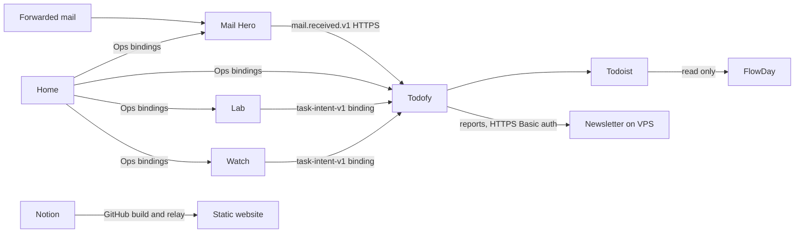

# Service boundaries

The repository has eight independently released Cloudflare applications and a separately released Newsletter
container service. [HANDOFF](../HANDOFF.md) records deployment evidence and what remains unverified; this page
describes the architecture, not a fresh production check. Development entry points are in the [root README](../README.md).

## Data and communication

No application imports another application's code, configuration or test tools. Shared code has four homes:

| Home | Responsibility | Production boundary |
| --- | --- | --- |
| `proto/` | IDL, generated types, wire JSON codecs, HTTP transcoder/client | Compiled into each actual user; generated directories are not committed |
| `contracts/` | Consumer semantics, schemas, golden fixtures and dependency-free value rules | Only explicitly mapped runtime files are bundled |
| `packages/edge-auth/` | Access JWT, signed double-submit CSRF, private headers | Compiled via `file:` dependency; Web Crypto, no runtime dependencies |
| `tools/` | Tests, builds and deployment checks | Never imported by production application source |

`PACKAGE_USERS`, `PROTO_USERS`, `PROTO_PACKAGES` and `BUNDLED_BY` in
[ci_changes.py](../.github/scripts/ci_changes.py) are checked against actual imports/dependencies.
Seven Cloudflare applications use edge-auth and the TypeScript proto runtime; Todofy also uses the Python runtime.
The website has neither shared contract nor shared runtime. Newsletter keeps its own container dependencies.

## Interfaces and compatibility

| Application | Owner IDL | Path prefix |
| --- | --- | --- |
| Mail Hero | `mailhero.ui.v2` | `/api/v2/` |
| Todofy | `todofy.ui.v1` | `/api/v1/` |
| Home | `dashboard.ui.v1` | `/api/v1/` |
| Lab | `lab.ui.v1` | `/api/v1/` |
| FlowDay | `flowday.ui.v1` | `/api/v1/` |
| Links | `links.ui.v1` | `/_/api/v1/` |
| Watch | `watch.ui.v1` | `/api/v1/` |

The [proto HTTP pattern](../proto/README.md#http-apis) owns route descriptors, request/response types and
Google RPC errors. Access, Origin and CSRF stay before body reads. Lists are bounded, paged through indexes,
and budgeted on the isolate's first request; FlowDay and Mail Hero warm up their heaviest codec/query paths.
Todofy's gateway sends decoded wire JSON over `COORDINATOR.owner_ui` to the Python object, which reads it
strictly and returns a generated response. The gateway reads that response and writes the wire JSON again.

Mail Hero's raw/attachment byte streams stay outside the transcoder under the same authentication and
`no-store`/`nosniff`/Content-Disposition headers. Its two heavy reads run the same transcoder in its DO.
Its backup machine API is a separate surface. Todofy's webhook, reports and health retain their transport,
paths and authentication in [machine-api-v1.openapi.yaml](../todofy/api/machine-api-v1.openapi.yaml).

Schemas generated from IDL are consumer artifacts, not competing handwritten sources. Golden payloads pin
published bytes, while legacy fixtures/schemas prove compatibility with persisted older events. `task-intent-v1`
still has handwritten value rules/schema checked against generated codecs. Do not delete these because
the owner APIs moved to proto. Dated old-owner routes are listed in [history](history.md#owner-api-compatibility).

## Home

Home is the owner launcher and operations console, not a second administrator of each application's storage.
It calls only the generated Ops methods through `MAIL_HERO`, `TODOFY`, `LAB` and `WATCH` bindings. It does not
read their D1, R2, private configuration or source. The four views are Home, Flows, Cloudflare and Ops.

Fetch/cron handlers authenticate, route and make one RPC; the SQLite `HomeState` owns the work. It serializes
each view once and the Worker forwards `PreEncoded` bytes with ETag/304, avoiding another decode/encode under
the ordinary Free request's 10 ms CPU limit. Wire conformance tests pin this property. Refresh is an
authenticated mutation (`POST /api/v1/homeView:refresh`), not a GET query parameter.

Bounded work remains mandatory:

- Each tick makes at most one `status()` call per application and one GraphQL usage query.
- The private configuration-drift check uses at most 12 read-only GETs per tick, finishes about every UTC day,
  and discards values while keeping binding names/types. Desired state is generated from the committed Wrangler
  files and deploy wrappers; a configuration change regenerates it in the same commit.
- Owner refresh is fetched at most once per minute. DO history is bounded; canary history lasts 60 days.
- `CF_ANALYTICS_TOKEN` goes only as Bearer to fixed read-only endpoints under
  `https://api.cloudflare.com/client/v4`. Least-privilege scopes and setup are in [setup §4](../dashboard/docs/setup.md).
- Drift names/results stay in HomeState and the Access-protected UI, never in public issues, artifacts or logs.
  Only counts enter the daily ops report.
- Usage at 80% of a daily allowance or monthly R2 operation allowance applies shed; below 70% or a new UTC day
  clears it. Shed expires and delays only explicitly deferrable work, never real-mail handling.
- Reminders go only through `TODOFY.reportOps`, at most one per UTC day; Mail Hero's `ALERT_WEBHOOK_URL` stays unconfigured.
  Quota numbers cite Cloudflare and match [limits](../dashboard/docs/limits.md).

The synthetic mail canary covers Mail Hero intake/delivery and Todofy model processing. It does not create
Todoist tasks, newsletters, summaries or reminders and does not count as real mail. Mail Hero's delivered state
means consumer durable acceptance; Todofy's later task success is a separate stage.

A future VPS/K3s collector must have a separate versioned machine contract and scoped authentication. Ops is
service-binding-only, not a public ingest API. No administrative kubeconfig, raw Kubernetes objects, secrets
or logs belong in Cloudflare. Fresh/stale/unknown, Git desired/applied revision, deployed build and business
success must stay distinct. Declaring a collector or a cluster does not prove that it has been installed.

## Application detail

- **Mail Hero:** Email Routing to one configured address, private raw mail in R2, D1 lifecycle ledger and
  SQLite DO alarms. Persistent retries resend the same frozen event identity/bytes/endpoint revision.
  [AGENTS](../mail-hero/AGENTS.md) and [setup](../mail-hero/docs/cloudflare-setup.md) govern storage, budget,
  backup leases, deletion and recovery. The backup collector image is separate from the Worker.
- **Todofy:** TypeScript gateway plus Python SQLite DO core, the ledger's only writer/scheduler. Mail receipts,
  summary work, Todoist outcomes and reconciliation use distinct durable states. See the
  [development invariants](../todofy/docs/dev-notes.md) and [gateway contract](../todofy/docs/gateway-contract.md).
- **Lab:** a daily fixed-host arXiv fetch, owner likes/seeds, Workers AI ranking and Chinese introductions under
  `LAB_DAILY_NEURONS`. DO alarms do not consume cron slots. Only an explicit owner confirmation proposes tasks;
  personal choices and send records stay in D1/DO, not ops output or logs. See [design](../lab/docs/design.md).
- **FlowDay:** read-only Todoist data plus local blocks/timers/reviews on D1. Keyset pages read about one page of
  rows, and write budgets stay small. The old container remains only for the dated rollback window;
  staging removal and Access changes go through infra, including F6 with owner approval.
  See [AGENTS](../flowday/AGENTS.md) and [rollout design](../flowday/docs/design.md).
- **Links:** public short links and an owner launcher under `/_/`. A redirect does one primary-key D1 read,
  zero writes/logs, and uses 302 only. A private key and a nonexistent key give anonymous callers the same
  response. Only `/_` and `/_/*` are behind Access. See [AGENTS](../links/AGENTS.md).
- **Watch:** one SQLite DO, no D1/R2 and no cron. Its exact fetch/redirect/robots/size/time budgets and URL
  refusals are in [AGENTS](../watch/AGENTS.md). Tests use synthetic sites. Notifications freeze task intents,
  include only owner-created names, trigger types/counts and app links, and never include page text or watched
  URLs. One digest after 14:00 UTC plus at most nine urgent intents obey Todofy's source limit of ten/day.
  BROKEN and automatic pauses enter the digest; status/guard reach Home through Ops.
- **Newsletter:** remains a VPS container because its workflow uses Codex CLI. It reads Todofy's machine reports
  through existing HTTPS/Basic auth, keeps its own state and publishes its own image. It does not import Todofy's
  implementation or share a release cycle. Its external `ziyixi-protos`/wire JSON runtime and machine HTTP model
  stay intact; deployment drain has an app-owned versioned JSON contract. Its [README](../newsletter/README.md)
  governs checks and updates. CI publishes the new `ghcr.io/ziyixi/todofy-newsletter` package; the existing VPS
  continues to use `ghcr.io/ziyixi/newsletter`. This foundation change does not upgrade the VPS.

## Website

Visitors read a Next.js static export served as Worker assets; no application request code reads Notion.
The Notion relay handles buttons and a 15-minute change detector. Its release workflow checks hourly
10:30–15:30 UTC for a missing daily reconcile, using the same gate/quiet period/concurrency as the relay;
the schedule only dispatches the release, and does not itself publish.

Publication uses `website-release.yml` and concurrency group `website-production`, whether started by CI,
Notion, schedule or a manual dispatch. GitHub Deployments (`website-release`) record the release identity.
Keep the gate, identity comparison, local/browser verification, live verification and rollback intact.
Notion content/media never enter source, and relay logs contain only result codes/counts.

The website's complete Custom Domain set is in `website/wrangler.toml`: `www.ziyixi.science` is canonical and
the apex serves the same site. Their dedicated shared certificate must not cover application hosts; the
[Hostnames explanation](../website/docs/architecture.md#hostnames) records the browser connection-coalescing issue.
The apex redirect Worker/routes are retired. Root MX/TXT/DKIM are protected and unrelated to site publishing.
See [release](../website/docs/release.md) and [architecture](../website/docs/architecture.md).

## Configuration and deployment ownership

Wrangler is the sole committed production configuration for Workers. Deploy wrappers add only private values,
operational switches and BUILD_SHA. The [service catalog](service-catalog.md) validates and references this
configuration; it must not introduce a second source for hostnames, binding IDs or bucket names.

`infra/` owns only its declared Cloudflare Access objects and D1/R2 existence, through reviewed plans and a gated
apply. It does not own Worker code, routes, DNS, Email Routing or resources outside its scope. VPS/K3s definitions
live separately under `clusters/vps/`. GitHub release, image publication, VPS update and business acceptance are
separate operations. [CI/CD](ci-cd.md) holds the detailed release and production-setting reference.
