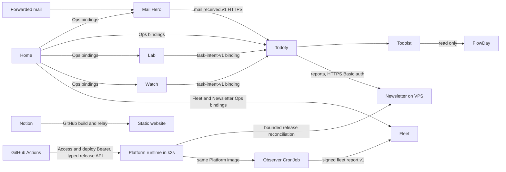

# Service boundaries

The repository manages Cloudflare applications and the VPS's k3s image workloads from one source tree.
The [service catalog](service-catalog.md) is the application inventory; it also distinguishes Cloudflare
Workers from VPS image repositories. [HANDOFF](../HANDOFF.md) records deployment evidence and what remains
unverified. This page describes the committed architecture, not a fresh production check. Development
entry points are in the [root README](../README.md).

## Data and communication

No application imports another application's code, configuration or test tools. Shared code has four homes:

| Home | Responsibility | Production boundary |
| --- | --- | --- |
| `proto/` | IDL, generated types, wire JSON codecs, HTTP transcoder/client | Compiled into each actual user; generated directories are not committed |
| `contracts/` | Consumer semantics, schemas, golden fixtures and dependency-free value rules | Only explicitly mapped runtime files are bundled |
| `packages/edge-auth/` | Access JWT, signed double-submit CSRF, private headers | Compiled via `file:` dependency; Web Crypto, no runtime dependencies |
| `tools/` | Tests, builds and deployment checks | Never imported by production application source |

`PACKAGE_USERS`, `PROTO_USERS`, `PROTO_PACKAGES` and `BUNDLED_BY` in
[ci_changes.py](../.github/scripts/ci_changes.py) are checked against actual imports/dependencies.
`edge-auth` and each language's proto runtime are compiled into their checked consumers. Todofy uses both
language runtimes; Platform uses the shared Python runtime for its API and observer reports, and Fleet
uses the TypeScript descriptions of those reports. The website has neither shared contract nor shared
runtime. Newsletter keeps its own locked container dependencies and existing external wire runtime.

## Interfaces and compatibility

| Application | Owner IDL | Path prefix |
| --- | --- | --- |
| Mail Hero | `mailhero.ui.v2` | `/api/v2/` |
| Todofy | `todofy.ui.v1` | `/api/v1/` |
| Home | `dashboard.ui.v1` | `/api/v1/` |
| Lab | `lab.ui.v1` | `/api/v1/` |
| FlowDay | `flowday.ui.v1` | `/api/v1/` |
| Links | `links.ui.v1` | `/_/api/v1/` |
| Watch | `watch.ui.v1` | `/api/v1/` |
| Fleet | `fleet.ui.v1` | `/api/v1/` |

The [proto HTTP pattern](../proto/README.md#http-apis) owns route descriptors, request/response types and
Google RPC errors. Browser owner APIs authenticate before body reads and require Origin/CSRF checks for
mutations. Fleet's owner API is read-only; its separate exact receipt path accepts only authenticated
machine reports. Lists are bounded, paged through indexes, and budgeted on the isolate's first request;
FlowDay and Mail Hero warm up their heaviest codec/query paths.
Todofy's gateway sends decoded wire JSON over `COORDINATOR.owner_ui` to the Python object, which reads it
strictly and returns a generated response. The gateway reads that response and writes the wire JSON again.

Mail Hero's raw/attachment byte streams stay outside the transcoder under the same authentication and
`no-store`/`nosniff`/Content-Disposition headers. Its two heavy reads run the same transcoder in its DO.
Its backup machine API is a separate surface. Todofy's webhook, reports and health retain their transport,
paths and authentication in [machine-api-v1.openapi.yaml](../todofy/api/machine-api-v1.openapi.yaml).

Platform's separate `platform.runtime.v1` machine API owns bounded node/workload reads and persisted
Create/Get/Resume release operations under `/api/v1/`. Actions sends frozen workload keys, source SHA,
image digests and request identity; it cannot send commands, YAML, paths or arbitrary URLs. Public
deployment requests pass Cloudflare Access and an independent Bearer check before body decoding.
Namespace, image repository and resource allowlists come from the daemon's mounted configuration.
See the [runtime contract](../contracts/platform-runtime-v1/README.md).

Schemas generated from IDL are consumer artifacts, not competing handwritten sources. Golden payloads pin
published bytes, while legacy fixtures/schemas prove compatibility with persisted older events. `task-intent-v1`
still has handwritten value rules/schema checked against generated codecs. Do not delete these because
the owner APIs moved to proto. Dated old-owner routes are listed in [history](history.md#owner-api-compatibility).

## Home

Home is the owner launcher and operations console, not a second administrator of each application's storage.
It calls only generated Ops methods through `MAIL_HERO`, `TODOFY`, `LAB`, `WATCH`, `FLEET` and `NEWSLETTER`
bindings. `FLEET` targets Fleet's `Ops`; `NEWSLETTER` targets its `NewsletterOps` projection of the latest
bounded host report. Home does not call the VPS directly or read an application's D1, R2, private
configuration or source. The four views are Home, Flows, Cloudflare and Ops.

Fetch/cron handlers authenticate, route and make one RPC; the SQLite `HomeState` owns the work. It serializes
each view once and the Worker forwards `PreEncoded` bytes with ETag/304, avoiding another decode/encode under
the ordinary Free request's 10 ms CPU limit. Wire conformance tests pin this property. Refresh is an
authenticated mutation (`POST /api/v1/homeView:refresh`), not a GET query parameter.

Bounded work remains mandatory:

- Each tick makes at most one `status()` call per application and one GraphQL usage query.
- The private configuration-drift check uses at most 12 read-only GETs per tick, finishes about every UTC day,
  and discards values while keeping binding names/types. Desired state is generated from the committed Wrangler
  files and deploy wrappers; a configuration change regenerates it in the same commit.
- Owner refresh is fetched at most once per minute. DO history is bounded; canary history lasts 60 days.
- `CF_ANALYTICS_TOKEN` goes only as Bearer to fixed read-only endpoints under
  `https://api.cloudflare.com/client/v4`. Least-privilege scopes and setup are in [setup §4](../dashboard/docs/setup.md).
- Drift names/results stay in HomeState and the Access-protected UI, never in public issues, artifacts or logs.
  Only counts enter the daily ops report.
- Usage at 80% of a daily allowance or monthly R2 operation allowance applies shed; below 70% or a new UTC day
  clears it. Shed expires and delays only explicitly deferrable work, never real-mail handling.
- Reminders go only through `TODOFY.reportOps`, at most one per UTC day; Mail Hero's `ALERT_WEBHOOK_URL` stays unconfigured.
  Quota numbers cite Cloudflare and match [limits](../dashboard/docs/limits.md).

The synthetic mail canary covers Mail Hero intake/delivery and Todofy model processing. It does not create
Todoist tasks, newsletters, summaries or reminders and does not count as real mail. Mail Hero's delivered state
means consumer durable acceptance; Todofy's later task success is a separate stage.

Fleet's receipt API uses the versioned [fleet-report-v1 contract](../contracts/fleet-report-v1/README.md)
and an independent HMAC key; its SQLite DO validates and persists bounded status snapshots. Ops remains
service-binding-only. Reports contain stable workload/node aliases, counts and shared runtime release
status, never administrative kubeconfig, raw Kubernetes objects, secrets, content or logs. Desired target,
physical image/process provenance, fresh observation and business health remain distinct. Neither an
accepted report nor a ready deployment receipt proves successful Newsletter delivery.

## Application detail

- **Mail Hero:** Email Routing to one configured address, private raw mail in R2, D1 lifecycle ledger and
  SQLite DO alarms. Persistent retries resend the same frozen event identity/bytes/endpoint revision.
  [AGENTS](../mail-hero/AGENTS.md) and [setup](../mail-hero/docs/cloudflare-setup.md) govern storage, budget,
  backup leases, deletion and recovery. The backup collector image is separate from the Worker.
- **Todofy:** TypeScript gateway plus Python SQLite DO core, the ledger's only writer/scheduler. Mail receipts,
  summary work, Todoist outcomes and reconciliation use distinct durable states. See the
  [development invariants](../todofy/docs/dev-notes.md) and [gateway contract](../todofy/docs/gateway-contract.md).
- **Lab:** a daily fixed-host arXiv fetch, owner likes/seeds, Workers AI ranking and Chinese introductions under
  `LAB_DAILY_NEURONS`. DO alarms do not consume cron slots. Only an explicit owner confirmation proposes tasks;
  personal choices and send records stay in D1/DO, not ops output or logs. See [design](../lab/docs/design.md).
- **FlowDay:** read-only Todoist data plus local blocks/timers/reviews on D1. Keyset pages read about one page of
  rows, and write budgets stay small. Historical container rollback material and production retirement
  evidence belong in HANDOFF/history; staging removal and Access changes go through reviewed infra.
  See [AGENTS](../flowday/AGENTS.md) and [rollout design](../flowday/docs/design.md).
- **Links:** public short links and an owner launcher under `/_/`. A redirect does one primary-key D1 read,
  zero writes/logs, and uses 302 only. A private key and a nonexistent key give anonymous callers the same
  response. Only `/_` and `/_/*` are behind Access. See [AGENTS](../links/AGENTS.md).
- **Watch:** one SQLite DO, no D1/R2 and no cron. Its exact fetch/redirect/robots/size/time budgets and URL
  refusals are in [AGENTS](../watch/AGENTS.md). Tests use synthetic sites. Notifications freeze task intents,
  include only owner-created names, trigger types/counts and app links, and never include page text or watched
  URLs. One digest after 14:00 UTC plus at most nine urgent intents obey Todofy's source limit of ten/day.
  BROKEN and automatic pauses enter the digest; status/guard reach Home through Ops.
- **Newsletter:** runs as an independent k3s image because its workflow uses Codex CLI. It reads Todofy's machine
  reports through existing HTTPS/Basic auth and keeps its own persistent state. It does not import Todofy's
  implementation. Its external `ziyixi-protos`/wire JSON runtime and private drain/monitor adapters stay intact.
  A daily CronJob owns the schedule; config-sync independently downloads validated editorial bundles. Its
  [README](../newsletter/README.md) governs business checks. CI publishes the catalog's immutable Newsletter
  image, paired with an independently tested Platform image of the same source SHA for a VPS release.
- **Platform:** the k3s Deployment exposes the shared-proto release/status API. A SQLite ledger persists frozen
  release targets and drain/apply/verify/resume checkpoints across its own image replacement. It reconciles only
  configured workloads through namespace-scoped Kubernetes permissions. API acceptance starts work; Actions
  waits for ready and fresh physical/process evidence. Held releases require an explicit resume or recovery.
- **Fleet:** an Access-protected, read-only Worker/UI and SQLite DO receive reports and expose k3s, release,
  system-unit and Newsletter status. The observer is a `*/5` CronJob with `Forbid` concurrency, the same Platform
  image, a separate state PVC and a projected read-only service account. It has no host PID/network, privileged
  mode or Docker socket. Exact read-only mounts provide host meminfo and the system D-Bus socket; Jeepney reads
  only fixed units' properties. A read-only socket mount does not restrict D-Bus method permissions: the
  container UID must have no host polkit grant to manage units. Unreadable evidence is unknown. Since the
  observer runs inside k3s, a cluster outage yields a stale/missing report rather than an independent live host
  diagnosis. Fleet never proxies deployment commands.

## Website

Visitors read a Next.js static export served as Worker assets; no application request code reads Notion.
The Notion relay handles buttons and a 15-minute change detector. Its release workflow checks hourly
10:30–15:30 UTC for a missing daily reconcile, using the same gate/quiet period/concurrency as the relay;
the schedule only dispatches the release, and does not itself publish.

Publication uses `website-release.yml` and concurrency group `website-production`, whether started by CI,
Notion, schedule or a manual dispatch. GitHub Deployments (`website-release`) record the release identity.
Keep the gate, identity comparison, local/browser verification, live verification and rollback intact.
Notion content/media never enter source, and relay logs contain only result codes/counts.

The website's complete Custom Domain set is in `website/wrangler.toml`: `www.ziyixi.science` is canonical and
the apex serves the same site. Their dedicated shared certificate must not cover application hosts; the
[Hostnames explanation](../website/docs/architecture.md#hostnames) records the browser connection-coalescing issue.
The apex redirect Worker/routes are retired. Root MX/TXT/DKIM are protected and unrelated to site publishing.
See [release](../website/docs/release.md) and [architecture](../website/docs/architecture.md).

## Configuration and deployment ownership

Each Worker's committed `wrangler.toml` is its sole production config. The strict public profile and resource
inventory under `config/` materialize only declared identity fields and Home resource identities; they do not
generate secrets or change application logic. Deploy wrappers add private values, operational switches and
BUILD_SHA. The [service catalog](service-catalog.md) references these configs rather than duplicating binding
IDs or bucket names.

`infra/` owns its declared Access/storage objects, GitHub/OTP identity providers, the exact Mail Hero inbox
rule, and the dedicated Platform HTTP Tunnel, configuration, machine identity and DNS record.
Worker code/routes remain with Wrangler. Other tunnels/DNS and the root mailbox stay outside that scope.
Account activation, the inbox subdomain and external OAuth registration are bootstrap prerequisites.
The Kubernetes API is not routed publicly.

Standard namespace-scoped k3s manifests/Kustomize assets live under `platform/k3s/`. Mounted public/private
configuration selects the namespace, state roots, provider identities and allowlisted images; a fresh account
or VPS does not require changing business IDL. One reviewed host bootstrap installs k3s/cloudflared and imports
private settings/state. Routine application and observer changes are image releases through the daemon API,
with no app Python or packaged executable on the host. [Rebuild](rebuild.md) gives the configuration,
bootstrap and release sequence; [verification](rebuild-verification.md) distinguishes simulated checks,
current-environment releases and the later fresh-account drill.
GitHub publication, VPS rollout and business acceptance remain separate operations. [CI/CD](ci-cd.md)
holds the release and production-setting reference.

The normal Worker release and drift repair share one reusable workflow and each app's release lock.
GitHub Deployments record the source/configuration and resource identities only after provider verification.
A repair selects that app's last verified release, preserves operational switches, and stops on changed
persistent identities or secrets. Infrastructure reconciliation automatically handles only its declared
routine fields; a saved sensitive plan needs an owner review and is checked again before apply.

The daemon's typed `GetReconcilePlan` describes bounded differences from the current accepted release.
`ReconcileRelease` uses its ETag and plan fingerprint, creates a new release transaction with a separate
drain key, and verifies actual workloads before success. Clean checks do not restart Pods. Pause, ledger,
Secrets and PVCs are preserved. Host-entry failure uses the fixed bootstrap bundle's owner recovery;
it does not broaden the daemon's API into SSH or cluster-admin access.
