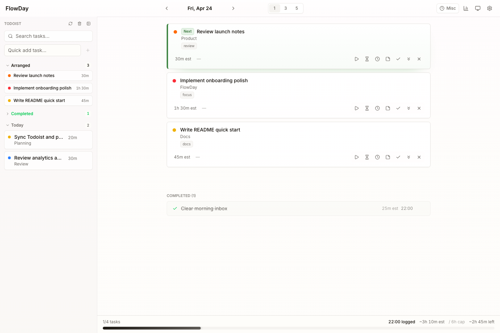
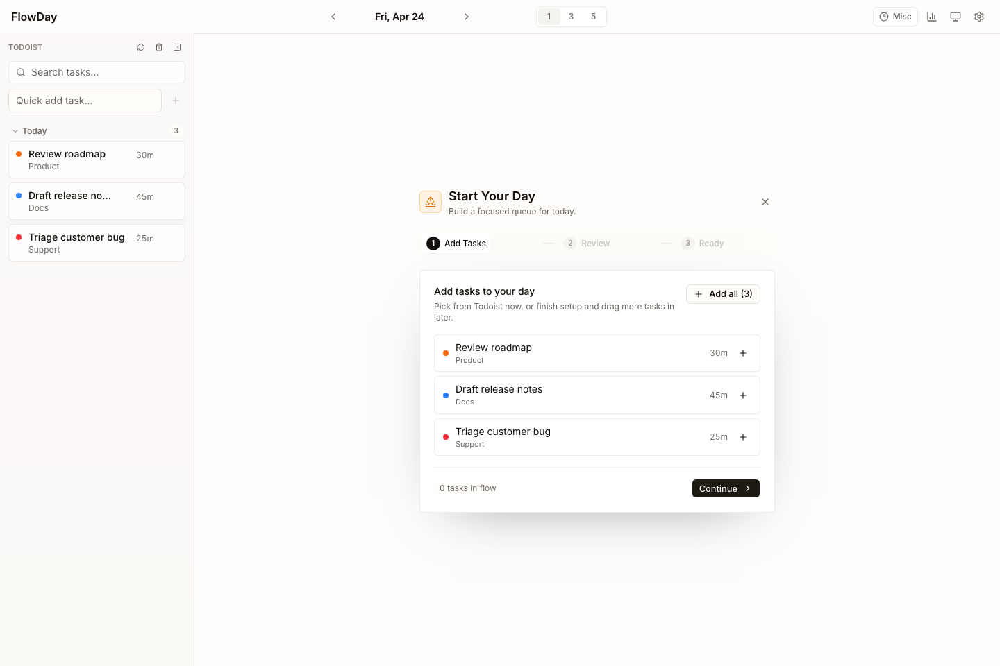
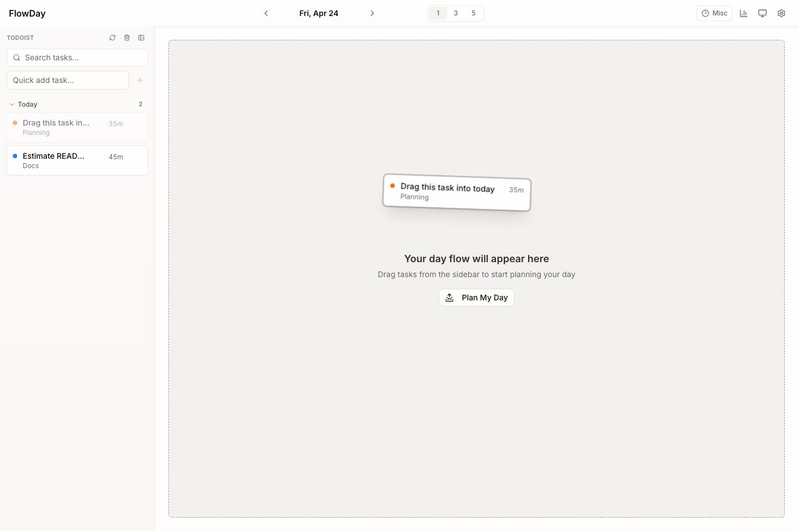
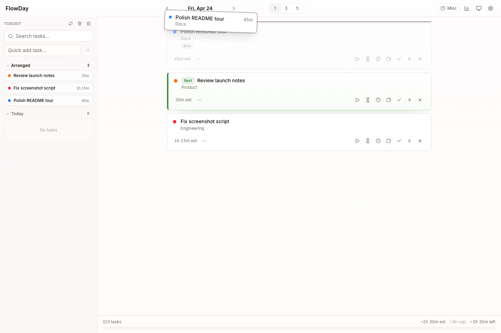
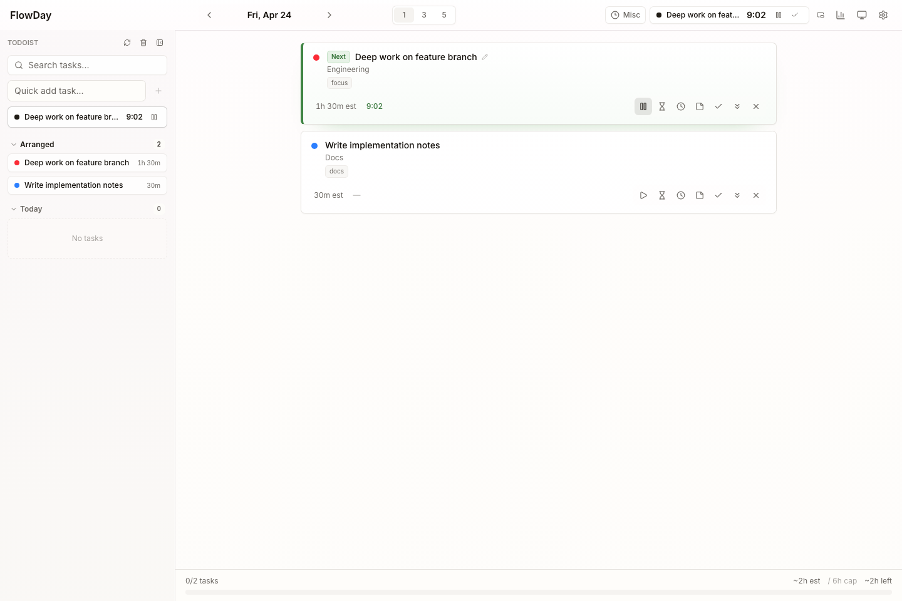
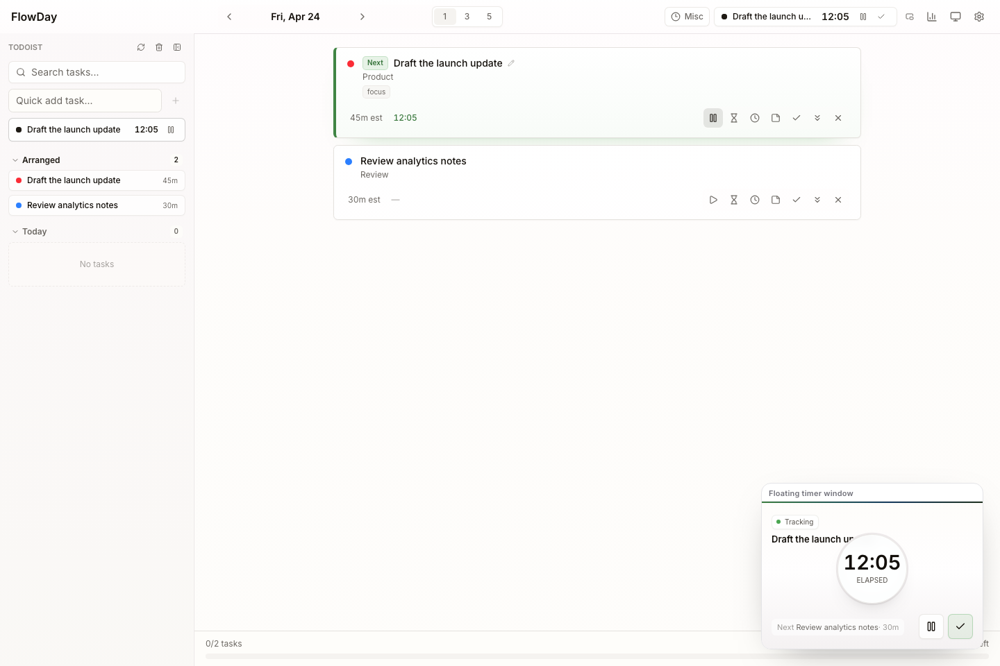
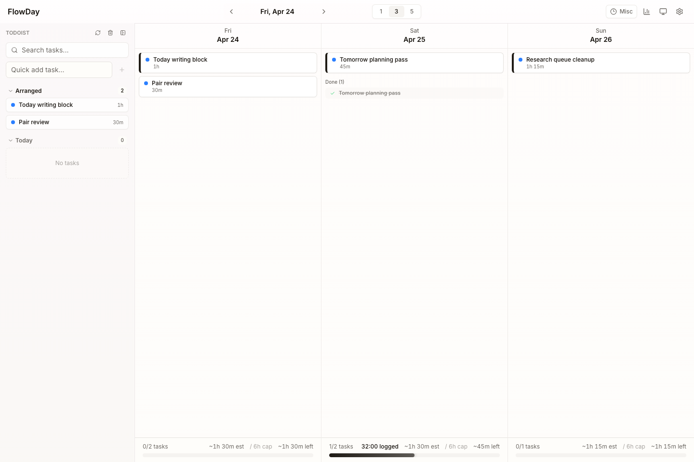
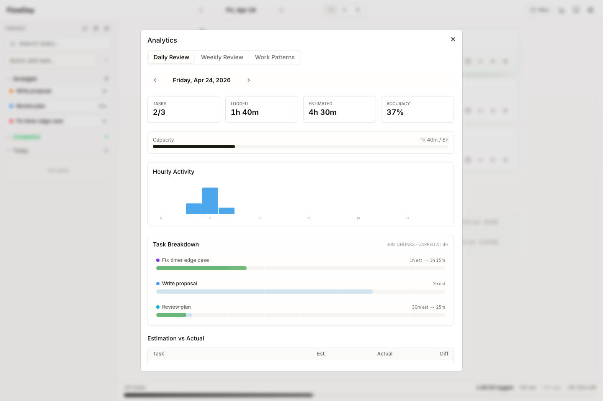

# FlowDay

FlowDay is a daily execution board for solo work: it shows your Todoist tasks, lets you pick what
belongs in today, order it as a queue, run a timer on one task at a time (time blocks, Pomodoro,
misc time), and review what actually happened.

Todoist is read-only for FlowDay. It never writes to Todoist; in this repository Todofy is the only
Todoist writer. Local tasks can be added without Todoist.



## Status

FlowDay was imported from the standalone `ziyixi/FlowDay` repository (commit `10a8f43`, without its history) and
ported to Workers Free (F1): one Worker, `flowday`, serves the UI as a Next.js static export and a small owner API
on D1, behind Cloudflare Access. See [`docs/design.md`](docs/design.md) for the design, the D1 write budget and the
measurements.

Since **F2** CI deploys it ("FlowDay deploy"): the Worker `flowday` and its D1 database `flowday` exist, behind the
existing Access app "flowday" (its AUD is committed). Since **F3** its only hostname is the staging host
**`flowday-next.ziyixi.science`** (a Custom Domain; the Access apps "flowday" and, for `/pwa/*`, "flowday-bypass"
cover it). The old container keeps serving `flowday.ziyixi.science` until the F4 cutover
([`docs/design.md`](docs/design.md) section 11). The staging host writes to the one production D1; F4 empties it
again before it imports the container's data.

## Layout

| Path | What it is |
| --- | --- |
| `wrangler.toml` | The Worker's production config (static assets from `web/out`, D1 `DB`, the Access AUD, the staging Custom Domain and `PUBLIC_HOST`) |
| `worker/` | The Worker: `src/` (router, Access and CSRF, API, D1 stores, the read-only Todoist sync), `test/` (Node unit tests; `test/runtime/` on workerd with real D1) |
| `migrations/` | D1 schema: `0001` is the container-era SQLite schema, unchanged; `0002` adds `tasks.todoist_project_id`; `0003` drops four indexes no query needs |
| `web/` | The UI (`app/`, `components/`, `features/`, `lib/`), its tests (`web/__tests__/`) and scripts |
| `deploy/` | `deploy-vars.mjs` (the deploy wrapper, Lab's shape: `BUILD_SHA` and the Worker secrets at deploy; refuses a placeholder D1 id or AUD) and its tests |
| `docs/design.md` | The Workers Free design: sync, write budget, limits, security, migration plan |
| `docs/prd.md` | Product requirements from the standalone repository (historical in parts) |
| `docs/ui-test-plan.md` | The UI test catalog; every `UI-###` id must match a Playwright test (`ui-test-plan-sync.test.ts`) |
| `docs/readme/`, `docs/ui-goldens/` | README figures and visual goldens, rendered from scripted synthetic data |

## Develop

Node.js 26 and npm.

```bash
cd flowday/worker && npm ci            # the Worker (and the pinned wrangler)
cd ../web && npm ci && npm run build   # the UI -> web/out
cd ../worker
cp ../.dev.vars.example ../.dev.vars   # synthetic local values
npx wrangler d1 migrations apply DB --local --config ../wrangler.toml
npm run dev                            # http://127.0.0.1:8789, local D1, loopback sign-in
```

| Where | Command | Use |
| --- | --- | --- |
| `worker/` | `npm run lint`, `npm run typecheck`, `npm test` | ESLint (strict, type-checked), tsc, Node unit tests |
| `worker/` | `npm run test:runtime` | workerd with real D1: schema, stores, API, Access/CSRF/PWA, sync, the write budget, CPU |
| `web/` | `npm run lint`, `npm run typecheck`, `npm test`, `npm run test:imports` | ESLint (no `fetch` outside `lib/client/http.ts`), tsc, Vitest, the import audit |
| `web/` | `npm run build`, `npm run check:export` | The static export, then: no test code, manifest with credentials, PWA files present |
| `web/` | `npm run test:ui` | Playwright (`desktop` and `portrait`) against `wrangler dev` with an `E2E_TEST_MODE=1` export and a fresh local D1 (`scripts/e2e-server.mjs`) |
| `web/` | `npm run screenshots:readme[:check]`, `npm run screenshots:ui[:check]` | Regenerate (or compare) the README figures and the goldens |
| `flowday/` | `node --test deploy/test/*.test.mjs` | The committed config and the deploy wrapper |

`E2E_TEST_MODE=1` exports include the `window.__FLOWDAY_E2E__` bridge, and the Worker serves `/api/test/*` only
with `E2E_TEST_ROUTES=true` under the loopback bypass. Screenshots and goldens are rendered on Ubuntu 24.04 with a
fixed date, viewport and seed data, so compare them on the same platform.

Test data is always synthetic. Never commit a database file, a real task title, a screenshot of real
data or a Todoist token.

## Deploy

Only from GitHub Actions: `FlowDay deploy` (`.github/workflows/ci.yml`) runs on `main` after `CI gate` when
`flowday/` or `packages/edge-auth/` changed (or on a dispatch with `flowday` or `all`), in the `production`
environment and the group `flowday-production`. It builds and checks the export, writes the secrets file,
dry-runs, runs the hostname guard (`tools/cf-guard`), applies the D1 migrations
(`wrangler d1 migrations apply DB --remote`), deploys through `deploy/deploy-vars.mjs`, and then checks production:

- through the API (`/health` needs an owner login): the Worker serves exactly one version at 100%, its
  `BUILD_SHA` is the commit, and no migration is pending;
- on the staging host, anonymously: `GET /` and `/api/tasks` are answered by Access with a 302 to its login page
  for this host (the dashboard's probe), the manifest, two icons and `/pwa/sw` by the Worker with 200 and their
  media types (through "flowday-bypass"), and `/pwa/sw.js`, which is not a public file, by the Worker's 401.

The deploy token is `CF_API_TOKEN`, as for Lab.

The wrapper writes four Worker secrets:

| Worker secret | From the `production` environment secret | Why |
| --- | --- | --- |
| `ACCESS_OWNER` | `DASHBOARD_ACCESS_OWNER` | FlowDay's owner is the dashboard's owner: one person with the same Access identities, so FlowDay reuses the dashboard's secret (as Lab does) instead of a copy that could drift |
| `ACCESS_OWNER_ALIASES` | `DASHBOARD_ACCESS_OWNER_ALIASES` | as above |
| `CSRF_SIGNING_KEY` | `FLOWDAY_CSRF_SIGNING_KEY` (FlowDay's own) | a separate key per app: a token of one app never verifies at another |
| `CREDENTIAL_KEY` | `FLOWDAY_CREDENTIAL_KEY` (FlowDay's own) | seals the Todoist key stored in D1 (AES-256-GCM, `worker/src/credentials.ts`). Keep an offline copy; losing or changing it only means entering the Todoist key again |

Inside the job the inputs keep their `FLOWDAY_*` names; only the job's `env:` maps the owner's two to the
dashboard's secrets, and `.github/scripts/test_wrangler_configs.py` checks that mapping (and that the dashboard's,
Lab's and FlowDay's wrappers accept the same owner values). A change to either owner secret reaches FlowDay only
with a FlowDay deploy: after changing one, dispatch `all` (or `dashboard`, `lab` and `flowday`), as
[`../dashboard/docs/setup.md`](../dashboard/docs/setup.md) §3 says. Each of FlowDay's two keys is 64 hex
characters, made where `gh` is logged in and never pasted anywhere; rotating one is the same command followed by a
FlowDay deploy:

```sh
openssl rand -hex 32 | gh secret set FLOWDAY_CSRF_SIGNING_KEY -R ziyixi/todofy --env production
```

The dashboard's daily drift check compares the live Worker with `dashboard/worker/src/drift-desired.json`
(generated by `.github/scripts/drift_desired.py`: these four secrets, `BUILD_SHA`, the config's bindings and the
staging Custom Domain).

### Rollback and removal

- **The first release.** `wrangler deploy` makes the Worker `flowday` live (with no route: unreachable), and the
  D1 `flowday` already has migrations `0001`–`0003`, before "Check that production runs this commit". If the job
  fails at or after "Apply D1 migrations, then deploy the Worker flowday", both stay; there is no earlier version.
  Nothing serves traffic and nothing runs on its own (no cron, no Durable Object), so it costs nothing while idle.
  **Reverting the F2 commit does not undo the deploy**: the revert also removes the `FlowDay deploy` job.
- **The staging host (F3).** Revert its commit on `main` (the `routes` line, `PUBLIC_HOST` and the regenerated
  drift state) and push. The revert's deploy does **not** remove the Custom Domain: wrangler leaves the live Custom
  Domains alone when the config lists none. Then detach `flowday-next.ziyixi.science` by hand: Cloudflare
  dashboard → Workers & Pages → `flowday` → Settings → Domains & Routes (this also removes its DNS record), and
  take the host out of the Access apps "flowday" and "flowday-bypass". In the other order the next FlowDay deploy
  would attach it again.
- **Worker code** (after the first release). Revert the commit on `main` and push: CI redeploys the previous code.
  For an immediate rollback, Cloudflare dashboard → Workers → `flowday` → Deployments → roll back to the previous
  version, and revert the commit too. D1 migrations are additive or drop only unread indexes (`docs/design.md`
  section 3), so older code reads the same data.
- **Remove FlowDay's Worker.** Remove `FlowDay deploy` and FlowDay from `PRODUCTION` (`test_wrangler_configs.py`)
  and `drift_desired.py`, and regenerate the dashboard's desired state, in one commit; then delete the Worker
  `flowday` in the Cloudflare dashboard. Delete the D1 `flowday` only on purpose (export it first with
  `wrangler d1 export`), and the secrets `FLOWDAY_CSRF_SIGNING_KEY` and `FLOWDAY_CREDENTIAL_KEY`
  (`gh secret delete <name> -R ziyixi/todofy --env production`). The `DASHBOARD_ACCESS_OWNER*` secrets stay (the
  dashboard and Lab use them), and so do the Access apps `flowday` and `flowday-bypass` (the container's hostname
  uses them until F6). Detach the staging Custom Domain first (above).

## Feature tour

Plan the day with the wizard, which checks the plan against your daily capacity:



Drag tasks from the sidebar into the day flow:



Reorder the queue when priorities change:



Run a timer on one task at a time:



Keep a small pop-out timer window open while working in other apps:



Look at the next three or five days:



Review the day or the week:


