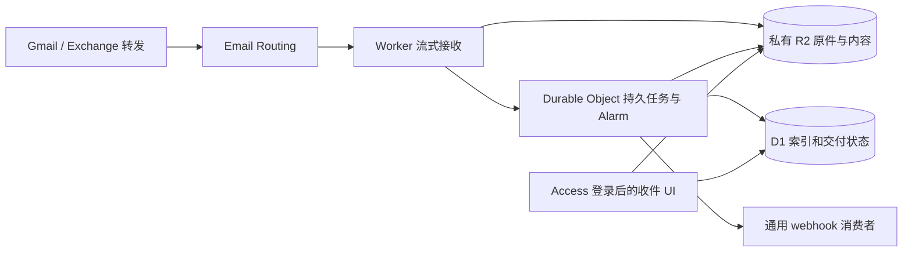

# Mail Hero

Mail Hero 是个人使用的邮件收件箱和通用 webhook 服务。默认部署在 **Cloudflare Workers Free + D1 + 私有 R2 + SQLite Durable Object Alarm** 上；React UI 也由同一 Worker 托管，登录使用 Cloudflare Access。Mail Hero 的运行不需要自建 Go、PostgreSQL 或 Tunnel。每天约 50–100 封邮件、一个固定收信地址，Todofy 只是可选消费者。



原件先保存，解析和投递随后进行。普通 Email Worker 保持短小；MIME 解析由 Durable Object Alarm 执行，避免在免费 Worker 的 10ms CPU 预算内解析整封邮件。原件、解析正文、附件和冻结事件放在 R2，D1 保存查询字段、状态和去重记录。重试沿用同一事件 ID，消费者需要自行持久接管和去重。

默认仅归档且强制暂停自动投递，不自动删除邮件。唯一收信地址通过 Worker 的 `RECEIVE_ADDRESS` 配置；没有地址管理平台，也不需要原邮箱密码。UI 支持邮件列表/正文/附件、解析状态、交付尝试、目标配置、重试和删除。

## 开发与部署

需要 Node.js 24。默认原生配置是 `cloudflare/wrangler.native.toml`，不要误用旧入口配置。

```sh
npm --prefix web ci
npm --prefix web run build
npm --prefix cloudflare ci
npm --prefix cloudflare run typecheck
npm --prefix cloudflare test
```

实际账户准备、D1/R2 创建、Access、唯一 Email Routing 规则、Wrangler 命令、验收和备份恢复步骤见 [Cloudflare 设置说明](docs/cloudflare-setup.md)。原生模块与配置合同见 [cloudflare/README.md](cloudflare/README.md)。

正式发布使用 [GitHub Actions CI/CD](docs/ci-cd.md)：`main` 的检查通过后发布原生 Worker 和网页。Mail Hero 无需 Docker 镜像或服务器拉取；Todofy 在独立仓库构建 GHCR 镜像，服务器按 digest 部署。

本次部署的 UI 为 [mail-hero.ziyixi.science](https://mail-hero.ziyixi.science)，固定收件地址为 `inbox-mail-hero@inbox.ziyixi.science`。实际资源、已完成检查和待验收事项见 [部署验收记录](docs/verification-native.md)；先完成登录和测试信验收，再开启原邮箱自动转发。

目标是使用免费额度，把日常增量费用控制在每月 $0–2；**这不是 Cloudflare 的硬账单上限**。不需要 Workers Paid 的 $5/月订阅。R2 仍须单独开通订阅，超额会计费；免费额度由账户内所有项目共享。具体限额、容量预警和停止条件在设置说明中列出。

本地模拟、账户部署、真实来源转发和灾难恢复是不同验收阶段。测试使用合成邮件；不能把成功构建或一次健康检查描述成邮件链路已经上线。

## 保留的旧实现

仓库中的 `cmd/`、`internal/`、根目录 `migrations/` 和 `deploy/compose*.yaml` 是旧 Go + PostgreSQL 服务；`cloudflare/wrangler.toml` 与 `cloudflare/src/index.ts` 是向该服务推送邮件的旧 Worker。它们保留作回退和历史参考，不属于默认原生部署。

旧模式的 [主机设置](docs/setup.md) 与 [运行手册](docs/operations.md) 只适用于该模式；`make local-init/local-db/local-run` 仍启动旧本地服务。旧数据库不是原生 D1 的自动迁移来源，不会在部署时导入真实邮件。

消费者合同仍是 [mail.received.v1](api/mail-received-v1.md)；开发协作和验收边界见 [AGENTS.md](AGENTS.md)。
