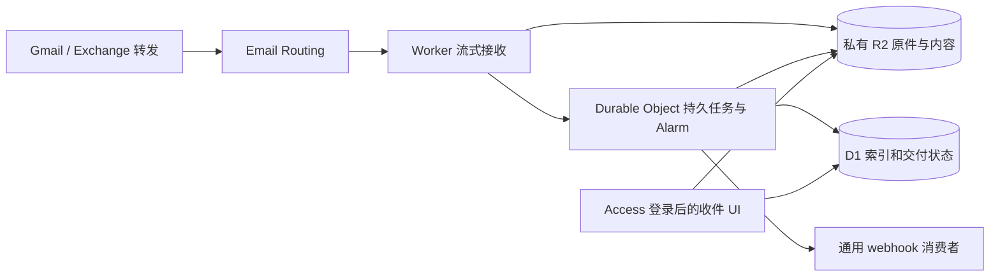

# Mail Hero

Mail Hero 是个人使用的邮件收件箱和通用 webhook 服务，完全运行在 **Cloudflare Workers Free + D1 + 私有 R2 + SQLite Durable Object Alarm** 上。React UI 由同一 Worker 托管，登录使用 Cloudflare Access。每天约 50–100 封邮件、一个固定收信地址，Todofy 是独立的可选消费者。



原件先保存，解析和投递随后进行。普通 Email Worker 保持短小；MIME 解析由 Durable Object Alarm 执行，避免在免费 Worker 的 10ms CPU 预算内解析整封邮件。原件、解析正文、附件和冻结事件放在 R2，D1 保存查询字段、状态和去重记录。重试沿用同一事件 ID，消费者需要自行持久接管和去重。

首次初始化时仅归档且强制暂停自动投递，不自动删除邮件。唯一收信地址通过 Worker 的 `RECEIVE_ADDRESS` 配置；没有地址管理平台，也不需要原邮箱密码。UI 支持邮件列表/正文/附件、解析状态、交付尝试、目标配置、重试和删除。消费者接入与转发验收见 [Mail Hero → Todofy](docs/todofy-integration.md)。

## 开发与部署

需要 Node.js 26 和 npm。生产配置是提交的 [`wrangler.toml`](wrangler.toml)（顶层即生产）；个人值与运维开关不提交，由 CI 部署时经 `deploy/deploy-vars.mjs` 注入。本地开发只用本地绑定，把 [`.dev.vars.example`](.dev.vars.example) 复制为 `.dev.vars`。

```sh
npm --prefix web ci
npm --prefix web run build
npm --prefix cloudflare ci
npm --prefix cloudflare run typecheck
npm --prefix cloudflare test
```

实际账户准备、D1/R2 创建、Access、唯一 Email Routing 规则、Wrangler 命令、验收和备份恢复步骤见 [Cloudflare 设置说明](docs/cloudflare-setup.md)。原生模块与配置合同见 [cloudflare/README.md](cloudflare/README.md)。

正式发布使用单仓库根目录的 [GitHub Actions CI/CD](docs/ci-cd.md)：`main` 上 `mail-hero/` 或共享鉴权包 [`packages/edge-auth/`](../packages/edge-auth/) 有改动且 `CI gate` 通过后发布原生 Worker 和网页。应用无需自建服务器；[原生备份](docs/native-backup.md)复用 Cloudflare DO/R2 执行；[离线恢复工具](deploy/backup/README.md)保留旧格式兼容，不依赖 VPS。Todofy 位于同一仓库的 [`todofy/`](../todofy/)，是独立的 webhook 消费者，单独检查和发布。

本次部署的 UI 为 [mail-hero.ziyixi.science](https://mail-hero.ziyixi.science)，固定收件地址（`inbox` 子域上的专用地址，值只保存在 GitHub secret `MAIL_HERO_RECEIVE_ADDRESS`，公开仓库不写明）。GitHub 登录与单封真实纯文本收件已验证；Todofy 完整业务链路仍需用户测试信验收。实际资源和检查范围见 [部署验收记录](docs/verification-native.md)，验收完成后再由用户切换原邮箱自动转发。

目标是使用免费额度，把日常增量费用控制在每月 $0–2；**这不是 Cloudflare 的硬账单上限**。不需要 Workers Paid 的 $5/月订阅。R2 仍须单独开通订阅，超额会计费；免费额度由账户内所有项目共享。具体限额、容量预警和停止条件在设置说明中列出。

本地模拟、账户部署、真实来源转发和灾难恢复是不同验收阶段。测试使用合成邮件；不能把成功构建或一次健康检查描述成邮件链路已经上线。

## 仓库结构

- `cloudflare/src/native/`：收信、解析、持久调度、webhook 与管理 API。
- `cloudflare/migrations/`、`cloudflare/test/`：D1 schema 与原生运行环境测试。
- `web/`：React UI；构建资源输出到 `uiassets/dist/`。
- `deploy/`：账户辅助工具、CI 配置生成与备份工具；工作流在单仓库根目录的 `.github/workflows/`。
- `docs/`：接入、部署和恢复说明。通用事件合同在单仓库根目录的 [`contracts/mail-received-v1/`](../contracts/mail-received-v1/)。

以下命令都在 `mail-hero/` 目录运行。

运维面：Worker 另外导出命名入口 `Ops`（[ops-v1](../contracts/ops-v1/README.md)），供同一账户内的仪表盘 Worker 通过 service binding 读取健康状态、设置降载 guard、发起并查询端到端金丝雀；没有新增公开路由，默认 `fetch`/`email` 行为不变。细节见 [cloudflare/README.md](cloudflare/README.md#ops-entrypoint-contractsops-v1) 与[设置说明 §2.3](docs/cloudflare-setup.md#23-运维入口ops-v1)。

消费者合同仍是 [mail.received.v1](../contracts/mail-received-v1/mail-received-v1.md)；开发协作和验收边界见 [AGENTS.md](AGENTS.md)。
