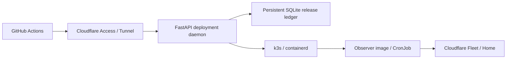

# VPS runtime · VPS 运行层

GitHub Actions 主动调用 daemon 的 HTTPS 发布 API。Cloudflare Access 和独立 Bearer 同时鉴权；
Actions 没有 SSH 私钥、Kubernetes token 或管理员 kubeconfig。daemon 使用官方 Kubernetes SDK，
只在配置的 namespace 操作固定运行资源。共享 proto 定义请求、错误和状态。

GitHub Actions pushes releases to the daemon HTTPS API, protected by Cloudflare Access and a separate
Bearer identity. The daemon uses the official Kubernetes SDK with namespace-scoped permissions.
Actions holds no SSH key or Kubernetes credential. Shared proto defines requests, errors and status.

A release closes Newsletter admission and suspends its trigger. Its durable drain must be frozen and
free of active work before replacing the engine. Historical unknown outcomes remain unchanged and
visible as degraded business health; they do not authorize a retry. The daemon upgrades itself first, then uses the new
version's baked Kustomize resources. Checkpoints survive restart. Only physical Pod image IDs, observed
Kubernetes generations and process-baked source SHA/request ID prove the running version. After those
checks it resumes Newsletter and reports ready. A held release requires an explicit same-ID, current-etag
resume; retrying CreateRelease alone never reopens admission or forces ambiguous deliveries.

| Directory | Responsibility |
| --- | --- |
| `src/personal_cloud/deployment/` | Typed API, durable release states, namespace operations |
| `src/personal_cloud/status_daemon/` | Bounded actual runtime observations and adapters |
| `src/personal_cloud/observer/` | Read-only observations and signed receipts from the observer image |
| `k3s/` | Standard Kustomize runtime, volumes and least-privilege bootstrap resources |
| `systemd/` | Dedicated HTTP tunnel unit |
| `versions.json` | Pinned k3s and manifest compiler versions/checksums |
| `../tools/vps-release/` | Actions HTTP client; no host commands or runtime source imports |
| `../tools/vps-bootstrap/` | One-time privileged installer and public bundle preparation |

Newsletter and the daemon remain separate images. Both carry the release's source SHA and are promoted
from the exact tested image tar; deployment uses registry digests. The daemon Deployment and observer
CronJob use the same platform image. No application executable or Python dependencies are installed on
the host. If k3s stops, Fleet marks observations stale or missing rather than guessing unit states.

The owner executes one prepared bootstrap with sudo. Initial engine admission stays frozen until the
first verified API release. See [rebuild](../docs/rebuild.md) for configuration, secrets and recovery limits.
Synthetic tests do not prove Codex login, external providers or a live new server.
The legacy editorial config-sync process downloads validated content bundles; it does not reconcile
infrastructure or choose executable releases. System installation and disaster recovery remain privileged.
